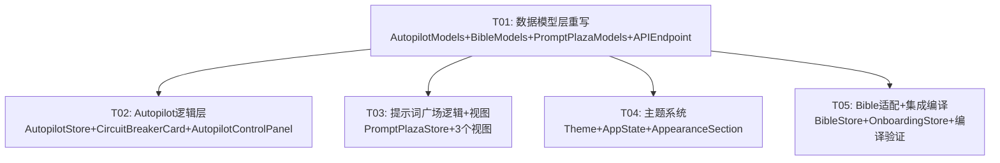

# 仓颉 iOS 阶段2 系统设计

> 架构师：高见远（Bob）  
> PRD 基准：产品经理许清楚 阶段2 PRD（163个功能点，6模块）  
> 原版基准：PlotPilot v4.6.0 Vue 前端  
> 阶段1状态：commit 39282d4，CI 编译通过  

---

## 一、实现方案概述

### 模块 2.1 — CircuitBreaker 字段重写（10项）

**核心问题**：iOS 现有 `CircuitBreakerStatus` 模型字段与原版 `AutopilotCircuitBreakerData`（autopilot.ts:30-36）完全不符——字段名错误（state→status、failure_count→error_count、threshold→max_errors），缺少嵌套对象 `last_error: AutopilotErrorRecord` 和数组 `error_history: [AutopilotErrorRecord]`，且自造了原版不存在的 `reset_timeout_seconds` 字段。

**修复方案**：
1. 新增 `AutopilotErrorRecord` 结构体（message/timestamp/context?）
2. 重写 `CircuitBreakerStatus` → 更名为 `AutopilotCircuitBreakerData`，字段对齐原版
3. `CircuitBreakerCard.swift` 视图适配新字段名
4. `AutopilotStore.swift` 中 `circuitBreaker` 类型更新

### 模块 2.2 — BibleGenerationStatus/Feedback 字段重写（8项）

**核心问题**：iOS 现有两个模型字段与原版完全不符。`BibleGenerationStatus` 现有 status/stage/progress/message，原版（bible.ts:252-256）是 `exists: Bool; ready: Bool; novel_id: String`。`BibleGenerationFeedback` 现有 feedback/suggestions，原版（bible.ts:262-275）是 `novel_id: String; error: String|null; stage: String|null; at: String|null`。

**修复方案**：
1. 重写 `BibleGenerationStatus`：exists/ready/novelId
2. 重写 `BibleGenerationFeedback`：novelId/error/stage/at
3. BibleStore.swift、OnboardingStore.swift 中引用类型自动适配（当前代码仅存储不访问字段，影响面可控）

### 模块 2.3 — 提示词广场数据模型重写（115项，最严重）

**核心问题**：iOS 现有 `PromptPlazaModels.swift` 中几乎所有模型字段都与原版（llmControl.ts:101-476）不符。`PromptNode` 20个字段中仅4个勉强对齐，`PromptTemplate` 完全错误，缺失 `PromptNodeDetail`/`PromptVersionDetail`/`VersionCompareResult`/`PromptStats`/`RenderResult`/`DebugResult`/`PromptChainResult`/`SandboxResult`/`VariableSchema`/`NodeBindingsResult`/`PlazaInitResult` 等模型。Store 缺失 chain/sandbox/variables/bindings/createNode/deleteNode/createTemplate/export/import/versionDetail 等 API。

**修复方案**：
1. **完全重写** `PromptPlazaModels.swift`，逐字段对齐原版 17 个接口/模型
2. **完全重写** `PromptPlazaStore.swift`，补齐所有缺失 API 方法
3. 视图适配：`PromptPlazaView.swift`/`PromptDetailView.swift`/`PromptVersionCompareView.swift`
4. 关键决策（主理人确认）：`PromptNode.id` 用原版 `id` 字段作 `Identifiable.id`，`nodeKey` 作为独立字段保留

### 模块 2.4 — Autopilot 启动参数补全（6项）

**核心问题**：`AutopilotStartRequest` 三字段全部 Optional（原版 autopilot.ts:12-16 全部 required），`maxAutoChapters` 在 Store 调用时未传入。`autoApproveMode` 开关存在 UI 但无 PATCH 端点调用。

**修复方案**：
1. `AutopilotStartRequest` 字段改为非 Optional，默认值对齐原版
2. `AutopilotStore.startAutopilot` 增加 `maxAutoChapters` 参数
3. 新增 `autoApproveMode` PATCH 端点调用（与 start 并行，仅当值变化时发送）—— 端点 `APIEndpoint.Novels.updateAutoApproveMode` 已存在（APIEndpoint.swift:52）
4. `AutopilotControlPanel.swift` 传参适配 + autoApproveMode 联动

### 模块 2.5 — Autopilot 轮询改自适应退避（8项）

**核心问题**：iOS 现有轮询为固定 3 秒间隔（AutopilotStore.swift:251），无 404 停止，无 failureCount 退避。原版（autopilotStatus.ts:112-120, useAssistedAutopilotStatus.ts）为 base 4s × 2^min(failureCount,8) 指数退避，上限 60s，404 停止轮询。

**修复方案**：
1. 新增 `assistedAutopilotPollDelay(failureCount:)` 函数，对齐原版公式
2. `AutopilotStore` 轮询逻辑改为自适应：成功重置 failureCount，404 停止，其他错误 failureCount+=1
3. `APIError.notFound` 用于 404 检测（APIError.swift:27,122 已存在）

### 模块 2.6 — 主题补 anchor 模式 + xlarge 字号（17项）

**核心问题**：`ThemeMode` 缺少 `.anchor`（黑金）模式（原版 themeStore.ts:6），`FontSizeScale` 缺少 `.xlarge` 档位且 small/large 的 scaleFactor 与原版不一致（原版 fontSizeStore.ts:8-13：small=0.875/large=1.125，iOS 现有 0.85/1.2）。

**修复方案**：
1. `ThemeMode` 新增 `.anchor` case + `isAnchor`/`isDark` 计算属性
2. `FontSizeScale` 新增 `.xlarge`，修正 small→0.875/large→1.125
3. `Theme.swift` 补 anchor 黑金色系 token
4. `AppState.swift`/`AppearanceSection.swift` 适配
5. 关键决策（主理人确认）：ThemeMode 保持 `system`（不改 `auto`），iOS 习惯

---

## 二、接口契约表

### 2.1 CircuitBreaker 接口契约

#### AutopilotErrorRecord（原版 autopilot.ts:24-28）

| 字段 | 类型 | 原版文件:行号 | iOS现状 | iOS修复后 | CodingKey |
|------|------|-------------|---------|-----------|-----------|
| message | String | autopilot.ts:25 | ❌ 缺失 | message: String | message |
| timestamp | String | autopilot.ts:26 | ❌ 缺失 | timestamp: String | timestamp |
| context | String? | autopilot.ts:27 | ❌ 缺失 | context: String? | context |

#### AutopilotCircuitBreakerData（原版 autopilot.ts:30-36）

| 字段 | 类型 | 原版文件:行号 | iOS现状（CircuitBreakerStatus） | iOS修复后（AutopilotCircuitBreakerData） | CodingKey |
|------|------|-------------|------|------|-----------|
| status | String ("closed"/"open"/"half_open") | autopilot.ts:31 | ❌ `state: String` (key="state") | status: String | status |
| errorCount | Int | autopilot.ts:32 | ❌ `failureCount: Int` (key="failure_count") | errorCount: Int | error_count |
| maxErrors | Int | autopilot.ts:33 | ❌ `threshold: Int` (key="threshold") | maxErrors: Int | max_errors |
| lastError | AutopilotErrorRecord? | autopilot.ts:34 | ❌ `lastFailureAt: String?` (key="last_failure_at") | lastError: AutopilotErrorRecord? | last_error |
| errorHistory | [AutopilotErrorRecord]? | autopilot.ts:35 | ❌ 缺失 | errorHistory: [AutopilotErrorRecord]? | error_history |
| ~~resetTimeoutSeconds~~ | ~~Int?~~ | 无 | ❌ 自造字段 | 删除 | — |

#### AutopilotStartRequest（原版 autopilot.ts:12-16）

| 字段 | 类型 | 原版文件:行号 | iOS现状 | iOS修复后 | CodingKey |
|------|------|-------------|---------|-----------|-----------|
| maxAutoChapters | Int (required) | autopilot.ts:13 | ❌ Optional, 默认9999, Store未传入 | Int (非Optional) | max_auto_chapters |
| targetChapters | Int (required) | autopilot.ts:14 | ❌ Optional | Int | target_chapters |
| targetWordsPerChapter | Int (required) | autopilot.ts:15 | ❌ Optional | Int | target_words_per_chapter |

#### autoApproveMode PATCH 端点

| 端点 | 方法 | 原版文件:行号 | iOS现状 | iOS修复后 |
|------|------|-------------|---------|-----------|
| /novels/{id}/auto-approve-mode | PATCH | (主理人决策) | ✅ 端点已存在 APIEndpoint.swift:52,639-660 | AutopilotStore 新增调用，与start并行，仅当值变化时发送 |

### 2.2 Bible 接口契约

#### BibleGenerationStatus（原版 bible.ts:252-256）

| 字段 | 类型 | 原版文件:行号 | iOS现状 | iOS修复后 | CodingKey |
|------|------|-------------|---------|-----------|-----------|
| exists | Bool | bible.ts:253 | ❌ `status: String` (key="status") | exists: Bool | exists |
| ready | Bool | bible.ts:253 | ❌ 缺失 | ready: Bool | ready |
| novelId | String | bible.ts:253 | ❌ 缺失 | novelId: String | novel_id |
| ~~stage~~ | ~~String?~~ | 无 | ❌ 自造 | 删除 | — |
| ~~progress~~ | ~~Double?~~ | 无 | ❌ 自造 | 删除 | — |
| ~~message~~ | ~~String?~~ | 无 | ❌ 自造 | 删除 | — |

#### BibleGenerationFeedback（原版 bible.ts:262-275）

| 字段 | 类型 | 原版文件:行号 | iOS现状 | iOS修复后 | CodingKey |
|------|------|-------------|---------|-----------|-----------|
| novelId | String | bible.ts:264 | ❌ 缺失 | novelId: String | novel_id |
| error | String? | bible.ts:265 | ❌ `feedback: String?` | error: String? | error |
| stage | String? | bible.ts:266 | ❌ 缺失 | stage: String? | stage |
| at | String? | bible.ts:267 | ❌ 缺失 | at: String? | at |
| ~~suggestions~~ | ~~[String]?~~ | 无 | ❌ 自造 | 删除 | — |

### 2.3 提示词广场接口契约（17个模型/接口）

#### PromptCategoryInfo（原版 llmControl.ts:104-111）

| 字段 | 类型 | 原版文件:行号 | iOS现状 | iOS修复后 | CodingKey |
|------|------|-------------|---------|-----------|-----------|
| key | String | llmControl.ts:105 | ✅ key | key: String | key |
| name | String | llmControl.ts:106 | ❌ `label: String` (key="label") | name: String | name |
| icon | String | llmControl.ts:107 | ✅ icon? | icon: String | icon |
| description | String | llmControl.ts:108 | ✅ description? | description: String | description |
| color | String | llmControl.ts:109 | ✅ color? | color: String | color |
| count | Int | llmControl.ts:110 | ❌ `promptCount: Int?` (key="prompt_count") | count: Int | count |
| ~~sortOrder~~ | ~~Int?~~ | 无 | ❌ 自造 | 删除 | — |

#### PromptTemplate（原版 llmControl.ts:114-126）

| 字段 | 类型 | 原版文件:行号 | iOS现状 | iOS修复后 | CodingKey |
|------|------|-------------|---------|-----------|-----------|
| id | String | llmControl.ts:115 | ✅ id | id: String | id |
| name | String | llmControl.ts:116 | ✅ name | name: String | name |
| description | String | llmControl.ts:117 | ✅ description? | description: String | description |
| category | String | llmControl.ts:118 | ✅ category | category: String | category |
| version | String | llmControl.ts:119 | ❌ 缺失 | version: String | version |
| author | String | llmControl.ts:120 | ❌ 缺失 | author: String | author |
| icon | String | llmControl.ts:121 | ❌ 缺失 | icon: String | icon |
| color | String | llmControl.ts:122 | ❌ 缺失 | color: String | color |
| isBuiltin | Bool | llmControl.ts:123 | ❌ 缺失 | isBuiltin: Bool | is_builtin |
| metadata | AnyCodable | llmControl.ts:124 | ❌ 缺失 | metadata: AnyCodable | metadata |
| nodeCount | Int | llmControl.ts:125 | ❌ 缺失 | nodeCount: Int | node_count |
| ~~content~~ | ~~String~~ | 无 | ❌ 自造 | 删除 | — |
| ~~variables~~ | ~~[String]?~~ | 无 | ❌ 自造 | 删除 | — |

#### PromptVariable（原版 llmControl.ts:129-135）

| 字段 | 类型 | 原版文件:行号 | iOS现状 | iOS修复后 | CodingKey |
|------|------|-------------|---------|-----------|-----------|
| name | String | llmControl.ts:130 | ❌ 模型缺失 | name: String | name |
| desc | String | llmControl.ts:131 | ❌ 模型缺失 | desc: String | desc |
| type | String | llmControl.ts:132 | ❌ 模型缺失 | type: String | type |
| required | Bool? | llmControl.ts:133 | ❌ 模型缺失 | required: Bool? | required |
| default | AnyCodable? | llmControl.ts:134 | ❌ 模型缺失 | default: AnyCodable? | default |

#### PromptNode（原版 llmControl.ts:138-159）

| 字段 | 类型 | 原版文件:行号 | iOS现状 | iOS修复后 | CodingKey |
|------|------|-------------|---------|-----------|-----------|
| id | String | llmControl.ts:139 | ❌ `var id: String { nodeKey }` | id: String（主理人决策：用原版id） | id |
| nodeKey | String | llmControl.ts:140 | ✅ nodeKey | nodeKey: String | node_key |
| name | String | llmControl.ts:141 | ❌ `title: String?` | name: String | name |
| description | String | llmControl.ts:142 | ✅ description? | description: String | description |
| category | String | llmControl.ts:143 | ✅ category? | category: String | category |
| source | String | llmControl.ts:144 | ❌ 缺失 | source: String | source |
| outputFormat | String ("text"/"json") | llmControl.ts:145 | ❌ 缺失 | outputFormat: String | output_format |
| contractModule | String? | llmControl.ts:146 | ❌ 缺失 | contractModule: String? | contract_module |
| contractModel | String? | llmControl.ts:147 | ❌ 缺失 | contractModel: String? | contract_model |
| tags | [String] | llmControl.ts:148 | ✅ tags? | tags: [String] | tags |
| variables | [PromptVariable] | llmControl.ts:149 | ❌ `variables: [String]?` | variables: [PromptVariable] | variables |
| variableNames | [String] | llmControl.ts:150 | ❌ 缺失 | variableNames: [String] | variable_names |
| systemFile | String? | llmControl.ts:151 | ❌ 缺失 | systemFile: String? | system_file |
| isBuiltin | Bool | llmControl.ts:152 | ❌ `enabled: Bool?` | isBuiltin: Bool | is_builtin |
| sortOrder | Int | llmControl.ts:153 | ❌ 缺失 | sortOrder: Int | sort_order |
| templateId | String | llmControl.ts:154 | ❌ 缺失 | templateId: String | template_id |
| versionCount | Int | llmControl.ts:155 | ❌ `currentVersionId: String?` | versionCount: Int | version_count |
| systemPreview | String | llmControl.ts:156 | ❌ 缺失 | systemPreview: String | system_preview |
| userTemplatePreview | String | llmControl.ts:157 | ❌ 缺失 | userTemplatePreview: String | user_template_preview |
| hasUserEdit | Bool | llmControl.ts:158 | ❌ 缺失 | hasUserEdit: Bool | has_user_edit |
| ~~content~~ | ~~String?~~ | 无 | ❌ 自造 | 删除 | — |
| ~~createdAt~~ | ~~String?~~ | 无 | ❌ 自造 | 删除 | — |
| ~~updatedAt~~ | ~~String?~~ | 无 | ❌ 自造 | 删除 | — |

#### PromptNodeDetail（原版 llmControl.ts:162-177）— 继承 PromptNode

| 字段 | 类型 | 原版文件:行号 | iOS现状 | iOS修复后 | CodingKey |
|------|------|-------------|---------|-----------|-----------|
| system | String | llmControl.ts:163 | ❌ 模型缺失 | system: String | system |
| userTemplate | String | llmControl.ts:164 | ❌ 模型缺失 | userTemplate: String | user_template |
| dagBindings | [DagBinding]? | llmControl.ts:165-171 | ❌ 缺失 | dagBindings: [DagBinding]? | dag_bindings |
| dagRegistryBindings | [DagRegistryBinding]? | llmControl.ts:172-176 | ❌ 缺失 | dagRegistryBindings: [DagRegistryBinding]? | dag_registry_bindings |

**DagBinding 子结构**（llmControl.ts:166-171）：nodeId, nodeType, label, displayName, promptMode  
**DagRegistryBinding 子结构**（llmControl.ts:173-176）：nodeType, displayName, promptMode

#### PromptVersion（原版 llmControl.ts:180-188）

| 字段 | 类型 | 原版文件:行号 | iOS现状 | iOS修复后 | CodingKey |
|------|------|-------------|---------|-----------|-----------|
| id | String | llmControl.ts:181 | ✅ id | id: String | id |
| versionNumber | Int | llmControl.ts:182 | ✅ versionNumber | versionNumber: Int | version_number |
| changeSummary | String | llmControl.ts:183 | ❌ `changeLog: String?` (key="change_log") | changeSummary: String | change_summary |
| createdBy | String | llmControl.ts:184 | ✅ createdBy? | createdBy: String | created_by |
| createdAt | String | llmControl.ts:185 | ✅ createdAt? | createdAt: String | created_at |
| systemPreview | String | llmControl.ts:186 | ❌ 缺失 | systemPreview: String | system_preview |
| userPreview | String | llmControl.ts:187 | ❌ 缺失 | userPreview: String | user_preview |
| ~~nodeKey~~ | ~~String~~ | 无 | ❌ 自造 | 删除 | — |
| ~~content~~ | ~~String~~ | 无 | ❌ 自造 | 删除 | — |

#### PromptVersionDetail（原版 llmControl.ts:191-194）— 继承 PromptVersion

| 字段 | 类型 | 原版文件:行号 | iOS现状 | iOS修复后 | CodingKey |
|------|------|-------------|---------|-----------|-----------|
| systemPrompt | String | llmControl.ts:192 | ❌ 模型缺失 | systemPrompt: String | system_prompt |
| userTemplate | String | llmControl.ts:193 | ❌ 模型缺失 | userTemplate: String | user_template |

#### VersionCompareResult（原版 llmControl.ts:197-204）

| 字段 | 类型 | 原版文件:行号 | iOS现状（PromptComparison） | iOS修复后 | CodingKey |
|------|------|-------------|---------|-----------|-----------|
| v1 | PromptVersionDetail | llmControl.ts:198 | ❌ `v1Id: String` | v1: PromptVersionDetail | v1 |
| v2 | PromptVersionDetail | llmControl.ts:199 | ❌ `v2Id: String` | v2: PromptVersionDetail | v2 |
| diff.systemChanged | Bool | llmControl.ts:201 | ❌ `diff: String?` | diff.systemChanged: Bool | diff.system_changed |
| diff.userChanged | Bool | llmControl.ts:202 | ❌ 缺失 | diff.userChanged: Bool | diff.user_changed |
| ~~v1Content~~ | ~~String~~ | 无 | ❌ 自造 | 删除 | — |
| ~~v2Content~~ | ~~String~~ | 无 | ❌ 自造 | 删除 | — |

#### PromptStats（原版 llmControl.ts:207-214）

| 字段 | 类型 | 原版文件:行号 | iOS现状 | iOS修复后 | CodingKey |
|------|------|-------------|---------|-----------|-----------|
| totalNodes | Int | llmControl.ts:208 | ✅ totalNodes | totalNodes: Int | total_nodes |
| totalTemplates | Int | llmControl.ts:209 | ❌ 缺失 | totalTemplates: Int | total_templates |
| totalVersions | Int | llmControl.ts:210 | ✅ totalVersions | totalVersions: Int | total_versions |
| builtinCount | Int | llmControl.ts:211 | ❌ 缺失 | builtinCount: Int | builtin_count |
| customCount | Int | llmControl.ts:212 | ❌ 缺失 | customCount: Int | custom_count |
| categories | [String: Int] | llmControl.ts:213 | ❌ `byCategory: [String:Int]` (key="by_category") | categories: [String: Int] | categories |

#### RenderResult（原版 llmControl.ts:217-220）

| 字段 | 类型 | 原版文件:行号 | iOS现状（PromptRenderResult） | iOS修复后 | CodingKey |
|------|------|-------------|---------|-----------|-----------|
| system | String | llmControl.ts:218 | ❌ `rendered: String` | system: String | system |
| user | String | llmControl.ts:219 | ❌ 缺失 | user: String | user |
| ~~variablesUsed~~ | ~~[String]?~~ | 无 | ❌ 自造 | 删除 | — |

#### DebugResult + DebugDiagnostics（原版 llmControl.ts:223-239）

| 字段 | 类型 | 原版文件:行号 | iOS现状（PromptDebugResult） | iOS修复后 | CodingKey |
|------|------|-------------|---------|-----------|-----------|
| success | Bool | llmControl.ts:224 | ❌ 缺失 | success: Bool | success |
| system | String | llmControl.ts:225 | ❌ `renderedPrompt` | system: String | system |
| user | String | llmControl.ts:226 | ❌ 缺失 | user: String | user |
| diagnostics | DebugDiagnostics | llmControl.ts:227-233 | ❌ 缺失 | diagnostics: DebugDiagnostics | diagnostics |
| nodeKey | String | llmControl.ts:234 | ✅ nodeKey | nodeKey: String | node_key |
| nodeName | String | llmControl.ts:235 | ❌ 缺失 | nodeName: String | node_name |
| variablesProvided | [String] | llmControl.ts:236 | ❌ `variables: [String:String]` | variablesProvided: [String] | variables_provided |
| elapsedMs | Int | llmControl.ts:237 | ❌ `latencyMs` (key="latency_ms") | elapsedMs: Int | elapsed_ms |
| error | String? | llmControl.ts:238 | ✅ error | error: String? | error |
| ~~modelResponse~~ | ~~String?~~ | 无 | ❌ 自造 | 删除 | — |
| ~~tokenInput~~ | ~~Int?~~ | 无 | ❌ 自造 | 删除 | — |
| ~~tokenOutput~~ | ~~Int?~~ | 无 | ❌ 自造 | 删除 | — |

**DebugDiagnostics 子结构**（llmControl.ts:227-233）：errors[String], warnings[String], missingVariables[String], renderedVariables[String], missingRequired[String]

#### PromptChainResult（原版 llmControl.ts:242-267）— iOS 完全缺失

| 字段 | 类型 | 原版文件:行号 | CodingKey |
|------|------|-------------|-----------|
| nodeKey | String | llmControl.ts:243 | node_key |
| nodeName | String | llmControl.ts:244 | node_name |
| category | String | llmControl.ts:245 | category |
| source | String | llmControl.ts:246 | source |
| bindings | [ChainBinding] | llmControl.ts:247-253 | bindings |
| reverseDependencies | [ReverseDep] | llmControl.ts:254-258 | reverse_dependencies |
| variables | [ChainVariable] | llmControl.ts:259-265 | variables |
| versionCount | Int | llmControl.ts:266 | version_count |

**ChainBinding**（llmControl.ts:248-253）：workflowId, workflowName, slot, priority, enabled  
**ReverseDep**（llmControl.ts:255-258）：workflowId, workflowName, slot  
**ChainVariable**（llmControl.ts:260-265）：name, type, source, required, default(AnyCodable)

#### SandboxResult（原版 llmControl.ts:270-286）— iOS 完全缺失

| 字段 | 类型 | 原版文件:行号 | CodingKey |
|------|------|-------------|-----------|
| valid | Bool | llmControl.ts:271 | valid |
| errors | [String] | llmControl.ts:272 | errors |
| warnings | [String] | llmControl.ts:273 | warnings |
| missingVariables | [String] | llmControl.ts:274 | missing_variables |
| missingRequired | [String] | llmControl.ts:275 | missing_required |
| systemPreview | String | llmControl.ts:276 | system_preview |
| userPreview | String | llmControl.ts:277 | user_preview |
| templateVariables | TemplateVariables | llmControl.ts:278-282 | template_variables |
| providedVariables | [String] | llmControl.ts:283 | provided_variables |
| elapsedMs | Int | llmControl.ts:284 | elapsed_ms |
| error | String? | llmControl.ts:285 | error |

**TemplateVariables**（llmControl.ts:278-282）：system[String], user[String], all[String]

#### VariableSchema（原版 llmControl.ts:289-299）— iOS 完全缺失

| 字段 | 类型 | 原版文件:行号 | CodingKey |
|------|------|-------------|-----------|
| name | String | llmControl.ts:290 | name |
| displayName | String | llmControl.ts:291 | display_name |
| type | String | llmControl.ts:292 | type |
| required | Bool | llmControl.ts:293 | required |
| default | AnyCodable | llmControl.ts:294 | default |
| description | String | llmControl.ts:295 | description |
| source | String | llmControl.ts:296 | source |
| scope | String | llmControl.ts:297 | scope |
| enumValues | [String] | llmControl.ts:298 | enum_values |

#### NodeBindingsResult（原版 llmControl.ts:302-315）— iOS 完全缺失

| 字段 | 类型 | 原版文件:行号 | CodingKey |
|------|------|-------------|-----------|
| nodeKey | String | llmControl.ts:303 | node_key |
| nodeName | String | llmControl.ts:304 | node_name |
| bindings | [NodeBinding] | llmControl.ts:305-313 | bindings |
| bindingCount | Int | llmControl.ts:314 | binding_count |

**NodeBinding**（llmControl.ts:306-313）：id, workflowId, workflowName, nodeKey, slot, priority, enabled

#### PlazaInitResult（原版 llmControl.ts:350-354）

| 字段 | 类型 | 原版文件:行号 | iOS现状（PromptPlazaInit） | iOS修复后 | CodingKey |
|------|------|-------------|---------|-----------|-----------|
| stats | PromptStats | llmControl.ts:351 | ❌ `stats: AnyCodable?` | stats: PromptStats | stats |
| categories | [PromptCategoryInfo] | llmControl.ts:352 | ✅ categories | categories: [PromptCategoryInfo] | categories |
| nodesByCategory | [String: [PromptNode]] | llmControl.ts:353 | ❌ `nodes: [PromptNode]` | nodesByCategory: [String: [PromptNode]] | nodes_by_category |

#### 请求 Payload 类型

**PromptUpdatePayload**（原版 llmControl.ts:319-326）— iOS 现有 `PromptUpdateRequest` 字段完全错误

| 字段 | 类型 | 原版文件:行号 | iOS现状 | iOS修复后 | CodingKey |
|------|------|-------------|---------|-----------|-----------|
| system | String? | llmControl.ts:320 | ❌ `content: String` | system: String? | system |
| userTemplate | String? | llmControl.ts:321 | ❌ 缺失 | userTemplate: String? | user_template |
| name | String? | llmControl.ts:322 | ❌ 缺失 | name: String? | name |
| description | String? | llmControl.ts:323 | ❌ 缺失 | description: String? | description |
| tags | [String]? | llmControl.ts:324 | ❌ 缺失 | tags: [String]? | tags |
| changeSummary | String? | llmControl.ts:325 | ❌ `changeLog` (key="change_log") | changeSummary: String? | change_summary |

**CreateNodePayload**（原版 llmControl.ts:328-336）— iOS 缺失

| 字段 | 类型 | 原版文件:行号 | CodingKey |
|------|------|-------------|-----------|
| templateId | String? | llmControl.ts:329 | template_id |
| nodeKey | String? | llmControl.ts:330 | node_key |
| name | String | llmControl.ts:331 | name |
| description | String? | llmControl.ts:332 | description |
| category | String? | llmControl.ts:333 | category |
| system | String? | llmControl.ts:334 | system |
| userTemplate | String? | llmControl.ts:335 | user_template |

**CreateTemplatePayload**（原版 llmControl.ts:338-342）— iOS 缺失

| 字段 | 类型 | 原版文件:行号 | CodingKey |
|------|------|-------------|-----------|
| name | String | llmControl.ts:339 | name |
| description | String? | llmControl.ts:340 | description |
| category | String? | llmControl.ts:341 | category |

**RenderPayload**（原版 llmControl.ts:344-346）— iOS 现有 `PromptRenderRequest` 错误（多了 nodeKey，variables 类型错误）

| 字段 | 类型 | 原版文件:行号 | iOS修复后 | CodingKey |
|------|------|-------------|-----------|-----------|
| variables | [String: AnyCodable] | llmControl.ts:345 | variables: [String: AnyCodable] | variables |

#### Store 缺失 API 对照表（原版 llmControl.ts:356-476）

| API方法 | 原版文件:行号 | iOS现状 | 端点（APIEndpoint 已有） |
|---------|-------------|---------|------------------------|
| plazaInit | llmControl.ts:358 | ✅ 存在（逻辑需适配新模型） | .promptsPlazaInit |
| getStats | llmControl.ts:361 | ✅ 存在 | .promptsStats |
| getCategoriesInfo | llmControl.ts:364 | ❌ 缺失 | .promptsCategoriesInfo |
| listTemplates | llmControl.ts:367 | ✅ 存在 | .promptsTemplates |
| createTemplate | llmControl.ts:370 | ❌ 缺失 | .createPromptNode (POST /templates) |
| listNodes | llmControl.ts:374 | ❌ 缺失 | .prompts |
| listNodesByCategory | llmControl.ts:384 | ❌ 缺失 | .promptsByCategory |
| getNodeDetail | llmControl.ts:388 | ✅ 存在（返回类型需改PromptNodeDetail） | .promptNode |
| createNode | llmControl.ts:392 | ❌ 缺失 | .createPromptNode |
| deleteNode | llmControl.ts:396 | ❌ 缺失 | .deletePromptNode |
| getNodeVersions | llmControl.ts:402 | ✅ 存在 | .promptVersions |
| getVersionDetail | llmControl.ts:406 | ❌ 缺失 | .promptVersion |
| updateNode | llmControl.ts:410 | ✅ 存在（payload需改） | .updatePrompt |
| rollbackNode | llmControl.ts:416 | ✅ 存在 | .rollbackPrompt |
| compareVersions | llmControl.ts:422 | ✅ 存在（返回类型需改） | .comparePrompts |
| renderPrompt | llmControl.ts:428 | ✅ 存在（payload需改） | .renderPrompt |
| exportAll | llmControl.ts:437 | ❌ 缺失 | .exportPrompts |
| importData | llmControl.ts:441 | ❌ 缺失 | .importPrompts |
| debugNode | llmControl.ts:450 | ✅ 存在（返回类型需改） | .debugPrompt |
| getPromptChain | llmControl.ts:457 | ❌ 缺失 | .promptChain |
| sandboxRender | llmControl.ts:461 | ❌ 缺失 | .promptSandbox |
| listVariables | llmControl.ts:468 | ❌ 缺失 | .promptVariables |
| getNodeBindings | llmControl.ts:474 | ❌ 缺失 | .promptBindings |

> **注意**：`createTemplate` 端点原版为 POST `/llm-control/prompts/templates`，但 iOS APIEndpoint 中无此独立 case。需新增 `APIEndpoint.LLMControl.createTemplate` case（path=/llm-control/prompts/templates, method=POST）。

### 2.6 主题接口契约

#### ThemeMode（原版 themeStore.ts:6）

| 原版值 | 原版文件:行号 | iOS现状 | iOS修复后 |
|--------|-------------|---------|-----------|
| light | themeStore.ts:6 | ✅ light = "浅色" | light = "浅色" |
| dark | themeStore.ts:6 | ✅ dark = "深色" | dark = "深色" |
| anchor | themeStore.ts:6 | ❌ 缺失 | anchor = "黑金" |
| auto | themeStore.ts:6 | ✅ system = "跟随系统" | system = "跟随系统"（主理人决策：保持system不改auto） |

#### ThemeMode 计算属性

| 属性 | 原版逻辑 | 原版文件:行号 | iOS现状 | iOS修复后 |
|------|---------|-------------|---------|-----------|
| isDark | mode=='dark' \|\| mode=='anchor'，auto→systemDark | themeStore.ts:24-27 | ❌ 仅 light/dark/system，无anchor | 新增anchor→true |
| isAnchor | mode=='anchor' | themeStore.ts:30 | ❌ 缺失 | 新增 |
| colorScheme | light→.light, dark→.dark, system→nil | — | ❌ 无anchor处理 | anchor→.dark |

#### FontSizeScale（原版 fontSizeStore.ts:6-13）

| 原版值 | 原版scaleFactor | 原版文件:行号 | iOS现状 | iOS修复后 |
|--------|----------------|-------------|---------|-----------|
| small | 0.875 | fontSizeStore.ts:9 | ❌ 0.85 | 0.875 |
| medium | 1 | fontSizeStore.ts:10 | ✅ 1.0 | 1.0 |
| large | 1.125 | fontSizeStore.ts:11 | ❌ 1.2 | 1.125 |
| xlarge | 1.25 | fontSizeStore.ts:12 | ❌ 缺失 | 1.25 |

---

## 三、文件清单及相对路径

### 需修改的文件

| # | 文件路径（相对 Cangjie/） | 改动摘要 | 对应原版文件 |
|---|------------------------|---------|-------------|
| 1 | Models/AutopilotModels.swift | ① 新增 AutopilotErrorRecord ② 重写 CircuitBreakerStatus→AutopilotCircuitBreakerData（status/errorCount/maxErrors/lastError/errorHistory） ③ AutopilotStartRequest 字段改非Optional | autopilot.ts:12-36 |
| 2 | Models/BibleModels.swift | ① 重写 BibleGenerationStatus（exists/ready/novelId） ② 重写 BibleGenerationFeedback（novelId/error/stage/at） | bible.ts:252-275 |
| 3 | Models/PromptPlazaModels.swift | **完全重写**：17个模型全部对齐原版，含 PromptNode(20字段)/PromptNodeDetail/PromptVersion/PromptVersionDetail/VersionCompareResult/PromptStats/RenderResult/DebugResult+DebugDiagnostics/PromptChainResult/SandboxResult/VariableSchema/NodeBindingsResult/PlazaInitResult/PromptTemplate/PromptVariable/PromptUpdatePayload/CreateNodePayload/CreateTemplatePayload/RenderPayload + 子结构 | llmControl.ts:101-476 |
| 4 | ViewModels/PromptPlazaStore.swift | **完全重写**：补齐12个缺失API（chain/sandbox/variables/bindings/createNode/deleteNode/createTemplate/export/import/versionDetail/listNodesByCategory/getCategoriesInfo），现有API适配新模型类型 | llmControl.ts:356-476 |
| 5 | ViewModels/AutopilotStore.swift | ① startAutopilot 增加 maxAutoChapters 参数 + autoApproveMode PATCH 并行调用 ② 轮询改为自适应退避（base 4s×2^min(fc,8) 上限60s + 404停止 + failureCount） | autopilot.ts:38-48, autopilotStatus.ts:112-120, useAssistedAutopilotStatus.ts |
| 6 | Theme/Theme.swift | ① ThemeMode 新增 .anchor + isAnchor/isDark/colorScheme ② FontSizeScale 新增 .xlarge + 修正 small=0.875/large=1.125 ③ 补 anchor 黑金色系 token | themeStore.ts:6-66, fontSizeStore.ts:6-13 |
| 7 | App/AppState.swift | 适配 ThemeMode.anchor + FontSizeScale.xlarge（UserDefaults 持久化已兼容） | themeStore.ts:37-40, fontSizeStore.ts:35-38 |
| 8 | Views/Settings/AppearanceSection.swift | 主题选择器4档（light/dark/anchor/system）+ 字号选择器4档（small/medium/large/xlarge）+ anchor 预览色 | ThemeAppearanceSection.vue:131-156 |
| 9 | Views/Autopilot/CircuitBreakerCard.swift | 适配新字段：state→status, failureCount→errorCount, threshold→maxErrors, lastFailureAt→lastError.message, 新增 errorHistory 展示 | autopilot.ts:30-36 |
| 10 | Views/Autopilot/AutopilotControlPanel.swift | startAutopilot 调用传入 maxAutoChapters + autoApproveMode 传参 | autopilot.ts:12-16 |
| 11 | Views/PromptPlaza/PromptPlazaView.swift | 适配新 PromptNode（name 替代 title, count 替代 promptCount, variables 为 [PromptVariable]）+ PlazaInitResult.nodesByCategory | llmControl.ts:138-159,350-354 |
| 12 | Views/PromptPlaza/PromptDetailView.swift | 适配新模型（system/userTemplate 替代 content, PromptVersionDetail, DebugResult.diagnostics, VersionCompareResult） | llmControl.ts:162-239 |
| 13 | Views/PromptPlaza/PromptVersionCompareView.swift | 适配 VersionCompareResult（v1/v2 PromptVersionDetail + diff.systemChanged/userChanged） | llmControl.ts:197-204 |
| 14 | Networking/APIEndpoint.swift | 新增 `APIEndpoint.LLMControl.createTemplate` case（POST /llm-control/prompts/templates） | llmControl.ts:370 |

### 需新建的文件

**无。** 阶段2全部为现有文件修改，不新建文件。所有模型放入现有 PromptPlazaModels.swift / AutopilotModels.swift / BibleModels.swift，Store 方法放入现有 Store 文件。

---

## 四、任务列表（有序，含依赖关系）

| # | 任务 | 涉及文件（相对 Cangjie/） | 依赖 | 对齐原版 | 优先级 |
|---|------|------------------------|------|---------|--------|
| T01 | 数据模型层重写（全部6模块模型） | Models/AutopilotModels.swift, Models/BibleModels.swift, Models/PromptPlazaModels.swift, Networking/APIEndpoint.swift | 无 | autopilot.ts:12-36, bible.ts:252-275, llmControl.ts:101-476 | P0 |
| T02 | Autopilot 逻辑层修正（2.1+2.4+2.5） | ViewModels/AutopilotStore.swift, Views/Autopilot/CircuitBreakerCard.swift, Views/Autopilot/AutopilotControlPanel.swift | T01 | autopilot.ts:12-48, autopilotStatus.ts:112-120, useAssistedAutopilotStatus.ts | P0 |
| T03 | 提示词广场逻辑层+视图（2.3） | ViewModels/PromptPlazaStore.swift, Views/PromptPlaza/PromptPlazaView.swift, Views/PromptPlaza/PromptDetailView.swift, Views/PromptPlaza/PromptVersionCompareView.swift | T01 | llmControl.ts:356-476 | P0 |
| T04 | 主题系统补全（2.6） | Theme/Theme.swift, App/AppState.swift, Views/Settings/AppearanceSection.swift | T01 | themeStore.ts:1-66, fontSizeStore.ts:1-51 | P0 |
| T05 | Bible Store 适配 + 全局编译集成（2.2 + 集成） | ViewModels/BibleStore.swift, ViewModels/OnboardingStore.swift, 全项目编译验证 | T01 | bible.ts:252-275 | P0 |

---

## 五、共享知识（跨文件约定）

### 编码约定

1. **Codable + CodingKeys**：所有数据模型使用 `Codable` + 显式 `CodingKeys` 枚举映射 snake_case → camelCase。不使用 `.convertFromSnakeCase`（保持精确控制）。
2. **decodeIfPresent 防御**：后端降级模式可能省略字段，所有非核心字段用 `decodeIfPresent` + 默认值。核心字段（如 PromptNode.id）也用 `decodeIfPresent` + `""` 默认值。
3. **AnyCodable**：动态 JSON 值（如 PromptTemplate.metadata、VariableSchema.default、PromptChainResult.variables[].default）使用 `AnyCodable`（CommonModels.swift:215-331）。AnyCodable 已支持 Bool/Int/Double/String/Array/Dict/Null。
4. **CangjieDecoder.shared**：所有从 AnyCodable → Codable 模型的二次解码使用 `CangjieDecoder.shared`（配置了微秒日期格式）。
5. **init(from:) 自定义**：嵌套对象（如 DebugDiagnostics、VersionCompareResult.diff）使用嵌套 Codable struct 或 nestedContainer 解码。

### iOS 16+ 兼容约束

- 禁用 `@Observable`/`@Bindable`（iOS 17+），使用 `ObservableObject` + `@Published`
- 禁用 `NavigationSplitView`（RootView 已用，嵌套崩溃），用 `HStack` 布局
- `Identifiable` 协议：`PromptNode.id` 用原版 `id` 字段（主理人决策），`nodeKey` 保留为独立字段

### 零新 SPM 依赖

- 仅 KeychainAccess 4.2.2，不引入任何新依赖
- 所有新模型用原生 Foundation Codable 实现

### 跨模块依赖关系

1. **T01 → T02/T03/T04/T05**：数据模型是所有逻辑层/视图层的基础，必须先完成
2. **T02 内部**：AutopilotModels 的 CircuitBreaker 重写 → AutopilotStore 类型更新 → CircuitBreakerCard/AutopilotControlPanel 视图适配
3. **T03 内部**：PromptPlazaModels 重写 → PromptPlazaStore API 补齐 → 3个视图适配
4. **T04 内部**：Theme.swift 枚举扩展 → AppState 适配 → AppearanceSection 视图适配
5. **T05 内部**：BibleModels 重写（T01已含）→ BibleStore/OnboardingStore 类型引用更新 → 全项目编译验证

### Autopilot 轮询退避公式（对齐原版 autopilotStatus.ts:112-120）

```swift
/// 对齐原版 assistedAutopilotPollDelayMs
/// base=4000ms, max=60000ms, mult=2^min(failureCount,8), 上限128
func assistedAutopilotPollDelay(failureCount: Int, baseMs: Int = 4000, maxMs: Int = 60000) -> Int {
    let mult = min(1 << min(failureCount, 8), 128)  // 2^min(fc,8), cap 128
    return min(baseMs * mult, maxMs)
}
```

### Autopilot 轮询状态机（对齐原版 useAssistedAutopilotStatus.ts）

```
成功 → failureCount=0, 继续轮询
404 (APIError.notFound) → stoppedForNotFound=true, 停止轮询
其他错误 → failureCount+=1, 继续轮询（delay 随 failureCount 指数增长）
novelId 变化 → resetBackoff（failureCount=0, stoppedForNotFound=false）
enabled=false → 停止轮询
```

### autoApproveMode PATCH 调用约定（主理人决策）

- 端点：`PATCH /api/v1/novels/{id}/auto-approve-mode`（APIEndpoint.Novels.updateAutoApproveMode 已存在）
- 时机：与 `POST /autopilot/{id}/start` 并行发起
- 条件：仅当 `autoApproveMode` 值与当前状态不同时才发送
- 请求体：`{"auto_approve_mode": Bool}`

### createTemplate 端点补充

原版 llmControl.ts:370 为 `POST /llm-control/prompts/templates`。iOS APIEndpoint.swift 现有 `.promptsTemplates`（GET，列表）但无 POST 创建端点。需在 `APIEndpoint.LLMControl` 中新增 `.createTemplate` case：
- path: `/llm-control/prompts/templates`
- method: POST

---

## 六、任务依赖图



---

## 七、UNCLEAR / 假设说明

1. **createTemplate 返回类型**：原版 llmControl.ts:371 返回 `{ status: string; template: PromptTemplate }`，iOS Store 方法需包装此返回类型。假设工程师用 `struct CreateTemplateResponse: Codable { let status: String; let template: PromptTemplate }` 接收。

2. **createNode 返回类型**：原版 llmControl.ts:393 返回 `{ status: string; node: PromptNode }`，同理需包装结构体。

3. **deleteNode 返回类型**：原版 llmControl.ts:397 返回 `{ status: string; node_id: string }`，同理。

4. **updateNode 返回类型**：原版 llmControl.ts:411 返回 `{ status: string; node: PromptNode | null; message: string }`，node 可能为 null，用 Optional 接收。

5. **importData 返回类型**：原版 llmControl.ts:442 返回 `{ status, summary: {created,updated,skipped,total}, errors: string[], message }`，需定义 ImportSummary 结构体。

6. **renderPrompt/sandboxRender 请求体**：renderPrompt 请求体为 `{ variables: Record<string, unknown> }`（llmControl.ts:429-432），sandboxRender 请求体为 `{ system, user_template, variables }`（llmControl.ts:462-465）。nodeKey 在 URL 路径中，不在请求体内。

7. **ThemeMode.anchor 色系**：原版 ThemeAppearanceSection.vue:266 使用 `linear-gradient(135deg, #0d0e14, #12141c)` 背景 + 金色 `#d4a843`/`#f5d485`。iOS 需在 Theme.swift 中定义 anchor 专属颜色 token（如 `anchorGold`、`anchorBackground`），具体色值从原版 CSS 提取。

8. **BibleGenerationStatus/Feedback 消费方**：经全项目搜索，`bibleStatus`（OnboardingStore）和 `generationStatus`（BibleStore）当前仅被存储和重置，无视图直接访问其字段。因此模型重写后无需修改视图层，仅需确保 Store 中类型引用正确。

9. **createTemplate 端点**：APIEndpoint.swift 现有 `.promptsTemplates`（GET）。原版 POST `/llm-control/prompts/templates` 需新增独立 case `.createTemplate`，不能复用 `.promptsTemplates`（方法不同）。
