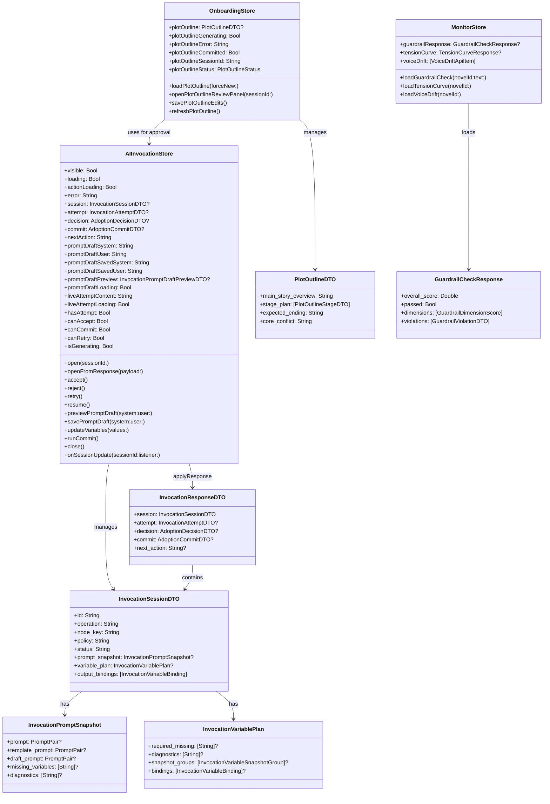
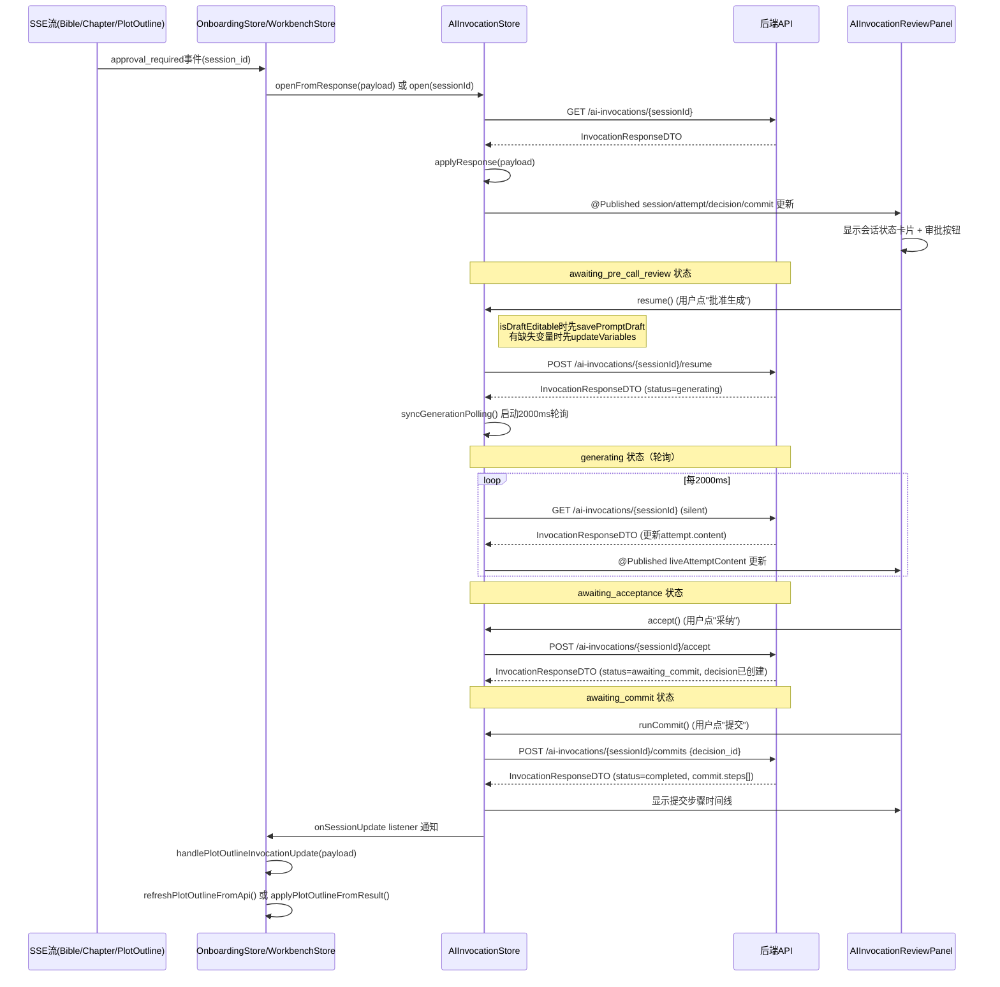
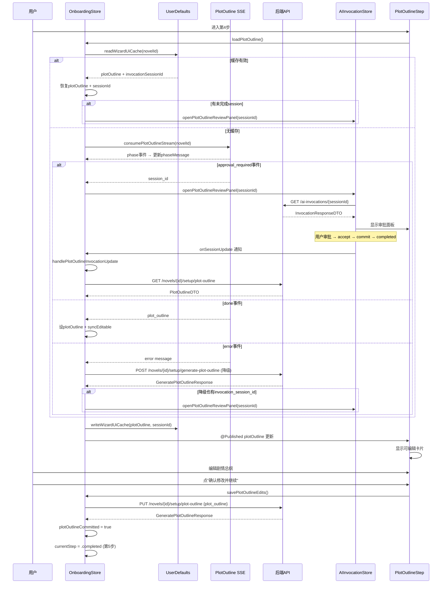
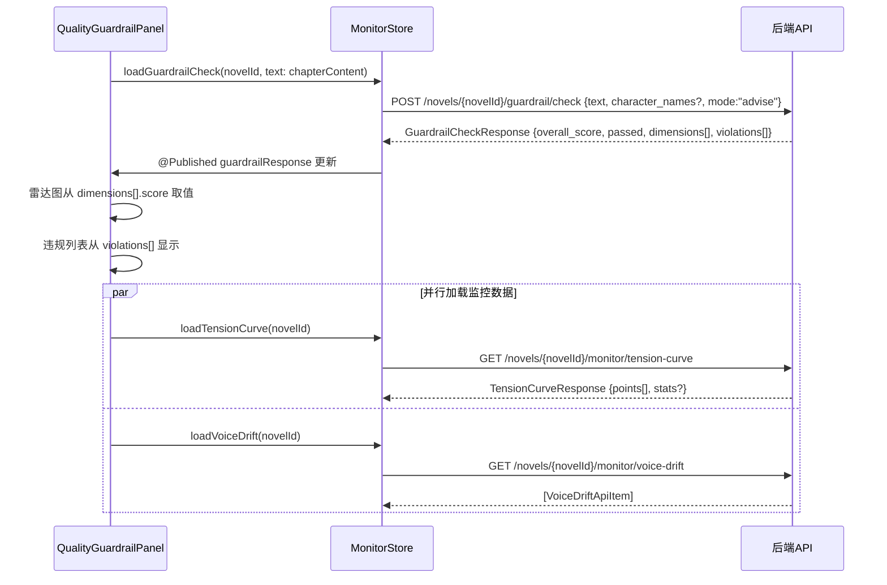
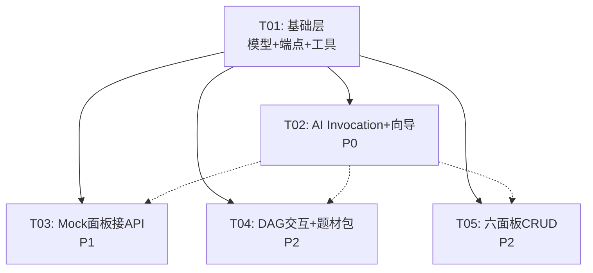

# 仓颉 iOS 阶段3 — 系统设计 + 接口契约表 + 任务分解

> **架构师**：高见远（Gao）
> **基于**：阶段3 PRD（157条原子功能清单）+ PlotPilot v4.6.0 原版 Vue 前端源码 + 仓颉 iOS 现有实现
> **遵守**：防砍功能约束方法 — 机制3：架构师出接口契约表
> **主理人8项决策**：全部执行（见下文决策执行表）

---

## 决策执行表（主理人8项决策）

| # | 决策内容 | 执行方式 |
|---|---------|---------|
| Q1 | AI Invocation headless自动推进 | iOS默认手动审批，**不实现** `advanceHeadlessSession`/`scheduleHeadlessAdvance`；`aiInvocationDebug=false` 硬编码 |
| Q2 | 生成轮询间隔 | 硬编码常量 `generationPollMs = 2000`（ms），不引入 runtimePerformance 配置 |
| Q3 | 向导第4步本地缓存 | UserDefaults，key = `wizard_ui_cache_{novelId}`，存 JSON（plotOutline + invocationSessionId） |
| Q4 | 步骤跳转权限 | `maxVisitedStep` 模式：只允许跳到 ≤ maxVisitedStep 的步骤；生成中禁止切换 |
| Q5 | 3.6六面板CRUD原版行号 | 已读原版6面板源码，下文接口契约表逐条标注（见3.6节） |
| Q6 | DAG提示词广场跳转 | 阶段2已实现 `PromptPlazaStore`（含 `loadNodeDetail`/`loadVersions` 等），NodeEditorDrawer "在广场编辑"按钮用 NavigationLink 跳转 PromptPlazaView，传 cpmsNodeKey |
| Q7 | QualityGuardrailPanel五维度来源 | **已确认**：原版用 `guardrailApi.check()` from `engineCore.ts:133-139`，端点 `POST /novels/{id}/guardrail/check`，返回 `GuardrailCheckResponse{overall_score, passed, dimensions[], violations[]}`。**不是**从 monitor.ts 的 tensionCurve/voiceDrift 拼装。monitor.ts 的两个端点用于 MonitorStore 独立展示。 |
| Q8 | featureFlags | iOS 不设 flag 机制：`aiInvocationDebug = false`（手动审批，审批面板始终可见），`variableCenterDebugPanels = true`（变量调试面板始终显示） |

---

## 1. 实现方案概述

| # | 模块 | 实现思路 | 对齐原版 |
|---|------|---------|---------|
| M1 | 3.1 AI Invocation 审批系统 | 4层全量新建：API层（9端点+15模型）→ Store层（状态机+轮询+监听）→ Utils层（JSON解析+路径取值）→ View层（Sheet审批面板）。SSE approval_required 事件接线到 OnboardingStore/WorkbenchStore。**不实现 headless 自动推进**（Q1）。 | aiInvocation.ts:1-256, aiInvocationStore.ts:1-527, invocationOutput.ts:1-165, AIInvocationReviewPanel.vue:1-901 |
| M2 | 3.2 向导补第4步 | OnboardingStep 枚举新增 plotOutline=4（替换 macroPlanning），completed=5。新建 PlotOutlineStep View（SSE流式+审批+可编辑卡片）。UserDefaults 缓存（Q3）。consumePlotOutlineStream SSE 消费函数。 | NovelSetupGuide.vue:522-675, 1068-1454, workflow.ts:682-806 |
| M3 | 3.3 DAG节点交互 | 新建3个组件：NodeContextMenu（长按菜单）、NodeDetailPanel（详情Sheet+写作遥测轮询）、NodeEditorDrawer（配置抽屉+广场跳转）。DAGCanvasView 长按/点击接线。 | NodeContextMenu.vue:1-113, NodeDetailPanel.vue:1-465, NodeEditorDrawer.vue:1-296 |
| M4 | 3.4 Mock面板接API | QualityGuardrailPanel 接 `guardrailApi.check()`（Q7确认）；ConsistencyReportPanel 接章节生成 done 事件的 consistency_report；ChapterElementPanel 接 chapterElementApi CRUD。 | engineCore.ts:98-147, monitor.ts:1-52, chapterElement.ts:1-75, workflow.ts:242-253 |
| M5 | 3.5 题材包接API | 新建 TaxonomyModels + MarketTaxonomyPicker 组件。GET /taxonomy/bundles/builtin_cn_v1 拉取题材包。CreateNovelSheet 替换硬编码 genreOptions。 | MarketTaxonomyPicker.vue:1-495, cnMarket.ts:1-54, builtin_cn_v1.bundle.json |
| M6 | 3.6 六面板全CRUD | 逐面板补 CRUD：伏笔（6 API）、道具（7 API）、演化（快照+闸门+覆盖）、编年史（双螺旋+回滚）、AntiAI（七层+扫描+规则）、对话沙盒（语料+生成器+anchor）。原版文件名已校正（见3.6节）。 | ForeshadowLedgerPanel.vue, ManuscriptPropsPanel.vue, StoryEvolutionPanel.vue, HolographicChroniclesPanel.vue, AntiAIDashboard.vue, DialogueCorpus.vue |

---

## 2. 文件列表及相对路径

### 2.1 新建文件

| # | 文件路径（相对 Cangjie/） | 模块 | 内容摘要 | 对齐原版文件 |
|---|------------------------|------|---------|-------------|
| 1 | `Models/AIInvocationModels.swift` | 3.1 | 15个数据模型 + 6个请求Payload + 2个枚举 | aiInvocation.ts:1-218 |
| 2 | `Utils/InvocationOutput.swift` | 3.1 | 9个JSON解析/路径取值工具函数 | invocationOutput.ts:1-165 |
| 3 | `ViewModels/AIInvocationStore.swift` | 3.1 | 审批状态机+9个API方法+轮询+监听 | aiInvocationStore.ts:1-527 |
| 4 | `Views/AIInvocation/AIInvocationReviewPanel.swift` | 3.1 | Sheet审批面板（15个UI区块） | AIInvocationReviewPanel.vue:1-901 |
| 5 | `Models/PlotOutlineModels.swift` | 3.2 | PlotOutlineStageDTO + PlotOutlineDTO + SSE事件 + 缓存模型 | workflow.ts:109-144 |
| 6 | `Views/Onboarding/PlotOutlineStep.swift` | 3.2 | 向导第4步View（生成+审批+可编辑卡片） | NovelSetupGuide.vue:522-675 |
| 7 | `Models/ChapterElementModels.swift` | 3.4 | ChapterElementDTO + ElementType/RelationType/Importance 枚举 | chapterElement.ts:1-75 |
| 8 | `Models/TaxonomyModels.swift` | 3.5 | TaxonomyBundle + TaxonomyNode + TaxonomyWritingProfile | builtin_cn_v1.bundle.json, cnMarket.ts:1-54 |
| 9 | `Views/Taxonomy/MarketTaxonomyPicker.swift` | 3.5 | 题材选择器（搜索+大类+主题+基调+写作原则） | MarketTaxonomyPicker.vue:1-495 |
| 10 | `Views/Autopilot/NodeContextMenu.swift` | 3.3 | 长按节点弹出菜单（查看详情+启禁用） | NodeContextMenu.vue:1-113 |
| 11 | `Views/Autopilot/NodeDetailPanel.swift` | 3.3 | 节点详情Sheet（状态条+基本信息+提示词+端口+遥测） | NodeDetailPanel.vue:1-465 |
| 12 | `Views/Autopilot/NodeEditorDrawer.swift` | 3.3 | 节点配置Sheet（提示词关联+运行参数+保存） | NodeEditorDrawer.vue:1-296 |
| 13 | `ViewModels/MonitorStore.swift` | 3.4 | 质量护栏+张力曲线+文风漂移数据加载 | monitor.ts:1-52, engineCore.ts:98-147 |

### 2.2 修改文件

| # | 文件路径（相对 Cangjie/） | 模块 | 改动内容 | 对齐原版文件 |
|---|------------------------|------|---------|-------------|
| 1 | `Networking/APIEndpoint.swift` | 全部 | 新增 AIInvocation/Monitor/ChapterElement/Taxonomy/Foreshadow/Prop/Guardrail 端点枚举 | — |
| 2 | `Models/MonitorModels.swift` | 3.4 | 新增 TensionCurve/VoiceDrift/GuardrailCheck 模型 | monitor.ts:1-52, engineCore.ts:98-147 |
| 3 | `ViewModels/OnboardingStore.swift` | 3.1+3.2 | OnboardingStep 枚举改5步；接入 approval_required；补第4步全部逻辑 | NovelSetupGuide.vue:1068-1454 |
| 4 | `Views/Onboarding/OnboardingWizardView.swift` | 3.2 | wizardSteps 改5步；TabView 新增 PlotOutlineStep；进度指示器5步 | NovelSetupGuide.vue:12-18 |
| 5 | `ViewModels/WorkbenchStore.swift` | 3.1 | 单章生成 SSE approval_required 接线 | workflow.ts:437-446 |
| 6 | `SSE/SSEStreamRegistry.swift` | 3.2 | 新增 startPlotOutlineStream 方法 | workflow.ts:682-771 |
| 7 | `Views/Panels/QualityGuardrailPanel.swift` | 3.4 | 替换硬编码，接 guardrailApi.check() | QualityGuardrailPanel.vue:1-300+ |
| 8 | `Views/Panels/ConsistencyReportPanel.swift` | 3.4 | 替换硬编码，接章节生成 consistency_report | workflow.ts:242-253, 453-463 |
| 9 | `Views/Panels/ChapterElementPanel.swift` | 3.4 | 替换空数组，接 chapterElementApi | chapterElement.ts:1-75 |
| 10 | `Views/Home/CreateNovelSheet.swift` | 3.5 | 替换硬编码 genreOptions，接入 MarketTaxonomyPicker | CreateNovelSheet.swift:47-50 |
| 11 | `ViewModels/AutopilotStore.swift` | 3.3 | DAG 节点交互（toggleNode/updateNodeConfig/loadNodePromptLive） | NodeDetailPanel.vue:340-344, NodeEditorDrawer.vue:183-204 |
| 12 | `Views/Panels/ForeshadowLedgerPanel.swift` | 3.6 | 补CRUD（list/create/update/remove/markConsumed）+筛选+Tab | ForeshadowLedgerPanel.vue:296-416 |
| 13 | `Views/Panels/PropManagerPanel.swift` | 3.6 | 补CRUD（list/create/patch/remove）+事件+详情抽屉 | ManuscriptPropsPanel.vue:223-379 |
| 14 | `Views/Panels/StoryEvolutionPanel.swift` | 3.6 | 补快照交互+闸门+覆盖+时间线 | StoryEvolutionPanel.vue |
| 15 | `Views/Panels/ChroniclesPanel.swift` | 3.6 | 重写双螺旋布局+回滚 | HolographicChroniclesPanel.vue:153-170 |
| 16 | `Views/Panels/AntiAIPanel.swift` | 3.6 | 补七层防御+扫描+规则+白名单 | AntiAIDashboard.vue |
| 17 | `Views/Panels/DialogueSandboxPanel.swift` | 3.6 | 补语料筛选+生成器+anchor读写 | DialogueCorpus.vue |
| 18 | `Models/ForeshadowModels.swift` | 3.6 | 补 ForeshadowEntry + Create/Update payload | foreshadow.ts:7-42 |
| 19 | `Models/PropModels.swift` | 3.6 | 补 PropDTO + PropEventDTO + CRUD | propApi.ts:3-87 |

---

## 3. 接口契约表（CRITICAL — 机制3核心产出）

### 3.1 AI Invocation 审批系统

#### 3.1.1 API 端点契约

| # | 功能 | HTTP方法 | 端点 | 请求体 | 响应 | 对齐原版文件:行号 |
|---|------|---------|------|--------|------|-----------------|
| 1 | 创建session | POST | `/ai-invocations` | `InvocationCreatePayload` | `InvocationResponseDTO` | aiInvocation.ts:221-223 |
| 2 | 获取session详情 | GET | `/ai-invocations/{sessionId}` | — | `InvocationResponseDTO` | aiInvocation.ts:224-226 |
| 3 | 采纳 | POST | `/ai-invocations/{sessionId}/accept` | `InvocationAcceptPayload` | `InvocationResponseDTO` | aiInvocation.ts:227-229 |
| 4 | 拒绝 | POST | `/ai-invocations/{sessionId}/reject` | `InvocationAcceptPayload` | `InvocationResponseDTO` | aiInvocation.ts:230-232 |
| 5 | 恢复（批准生成） | POST | `/ai-invocations/{sessionId}/resume` | `InvocationResumePayload` | `InvocationResponseDTO` | aiInvocation.ts:233-235 |
| 6 | 重新生成 | POST | `/ai-invocations/{sessionId}/retry` | `InvocationResumePayload`(默认`{}`) | `InvocationResponseDTO` | aiInvocation.ts:236-238 |
| 7 | 预览提示词草稿 | POST | `/ai-invocations/{sessionId}/prompt-draft/preview` | `InvocationPromptDraftPayload` | `InvocationPromptDraftPreviewDTO` | aiInvocation.ts:239-244 |
| 8 | 保存提示词草稿 | PUT | `/ai-invocations/{sessionId}/prompt-draft` | `InvocationPromptDraftPayload` | `InvocationResponseDTO` | aiInvocation.ts:245-247 |
| 9 | 更新变量 | PUT | `/ai-invocations/{sessionId}/variables` | `InvocationVariableUpdatePayload` | `InvocationResponseDTO` | aiInvocation.ts:248-250 |
| 10 | 提交 | POST | `/ai-invocations/{sessionId}/commits` | `{decision_id: String}` | `InvocationResponseDTO` | aiInvocation.ts:251-255 |

#### 3.1.2 数据模型契约

| # | 模型名 | 字段 | 类型 | CodingKeys | 对齐原版文件:行号 |
|---|--------|------|------|-----------|-----------------|
| 1 | `InvocationPolicy` | DIRECT / REVIEW_BEFORE_CALL / REVIEW_AFTER_CALL / FULL_INTERACTIVE / INTERACTIVE_WHEN_AVAILABLE / AUTOPILOT_PAUSE | enum String | — | aiInvocation.ts:5-11 |
| 2 | `InvocationSessionStatus` | requested / spec_resolved / context_resolved / variables_resolved / prompt_compiled / awaiting_pre_call_review / generating / awaiting_acceptance / awaiting_commit / committing / completed / blocked / failed / cancelled | enum String | — | aiInvocation.ts:13-27 |
| 3 | `InvocationPromptSnapshot` | prompt?{system?,user?} / template_prompt?{system?,user?} / draft_prompt?{system?,user?} / node_key? / node_version_id? / asset_link_set_id? / input_binding_set_id? / output_binding_set_id? / variable_snapshot_hash? / template_hash? / composition_hash? / rendered_prompt_hash? / missing_variables?[String] / diagnostics?[String] / asset_version_ids?[String] | struct Codable | snake_case | aiInvocation.ts:29-54 |
| 4 | `InvocationVariablePlan` | aliases?[String:AnyCodable] / resolution_items?[InvocationVariableResolutionItem] / required_missing?[String] / diagnostics?[String] / lineage?[String:String] / snapshot_hash? / snapshot_items?[InvocationVariableSnapshotItem] / snapshot_groups?[InvocationVariableSnapshotGroup] / bindings?[InvocationVariableBinding] | struct Codable | snake_case | aiInvocation.ts:56-66 |
| 5 | `InvocationVariableResolutionItem` | alias? / variable_key? / display_name? / status? / current_value?(AnyCodable) / value_type? / version_number?(Int) / source? / context_key? / required?(Bool) | struct Codable | snake_case | aiInvocation.ts:68-79 |
| 6 | `InvocationVariableBinding` | alias(String) / variable_key? / required?(Bool) / default?(AnyCodable) / source? / enabled?(Bool) / value_type? / scope? / stage? / display_name? / target_display_name? / source_path? / projection_key? / render_mode? / preview_source? | struct Codable | snake_case | aiInvocation.ts:81-97 |
| 7 | `InvocationVariableSnapshotItem` | key? / display_name? / value?(AnyCodable) / type? / scope? / stage? / source? / variable_key? / required?(Bool) / source_path? / projection_key? / render_mode? | struct Codable | snake_case | aiInvocation.ts:99-112 |
| 8 | `InvocationVariableSnapshotGroup` | id? / scope? / stage? / title? / items?[InvocationVariableSnapshotItem] | struct Codable | — | aiInvocation.ts:114-120 |
| 9 | `InvocationSessionDTO` | id(String) / operation(String) / node_key(String) / policy(String) / status(String) / context?[String:AnyCodable] / metadata?[String:AnyCodable] / attempts?[String] / prompt_snapshot? / variable_plan? / output_bindings?[InvocationVariableBinding] | struct Codable | snake_case | aiInvocation.ts:122-134 |
| 10 | `InvocationAttemptDTO` | id(String) / session_id(String) / status(String) / content(String) / error?(String) | struct Codable | snake_case | aiInvocation.ts:136-142 |
| 11 | `AdoptionDecisionDTO` | id(String) / session_id(String) / attempt_id(String) / decision(String) / accept_content(Bool) / commit_prompt_version(Bool) / commit_variable_outputs(Bool) / commit_variable_bindings(Bool) | struct Codable | snake_case | aiInvocation.ts:144-153 |
| 12 | `AdoptionCommitStepDTO` | name(String) / status(String) / result?[String:AnyCodable] / error?(String) | struct Codable | — | aiInvocation.ts:155-160 |
| 13 | `AdoptionCommitDTO` | id(String) / session_id(String) / decision_id(String) / status(String) / steps[AdoptionCommitStepDTO] / result?[String:AnyCodable] / error?(String) | struct Codable | snake_case | aiInvocation.ts:162-170 |
| 14 | `InvocationResponseDTO` | session(InvocationSessionDTO) / attempt?(InvocationAttemptDTO?) / decision?(AdoptionDecisionDTO?) / commit?(AdoptionCommitDTO?) / next_action?(String) | struct Codable | snake_case | aiInvocation.ts:172-178 |
| 15 | `InvocationCreatePayload` | operation(String) / node_key(String) / variables?[String:AnyCodable] / context?[String:AnyCodable] / policy?(String) / config?[String:AnyCodable] / metadata?[String:AnyCodable] | struct Codable | — | aiInvocation.ts:180-188 |
| 16 | `InvocationAcceptPayload` | attempt_id(String) / accepted_by?(String) / commit_prompt_version?(Bool) / commit_variable_outputs?(Bool) / commit_variable_bindings?(Bool) / metadata?[String:AnyCodable] | struct Codable | snake_case | aiInvocation.ts:190-197 |
| 17 | `InvocationResumePayload` | resumed_by?(String) / config?[String:AnyCodable] / metadata?[String:AnyCodable] | struct Codable | — | aiInvocation.ts:199-203 |
| 18 | `InvocationPromptDraftPayload` | system_template(String) / user_template?(String?) | struct Codable | snake_case | aiInvocation.ts:205-208 |
| 19 | `InvocationVariableUpdatePayload` | values[String:AnyCodable] / updated_by?(String) | struct Codable | — | aiInvocation.ts:210-213 |
| 20 | `InvocationPromptDraftPreviewDTO` | prompt_snapshot(InvocationPromptSnapshot) / variable_plan?(InvocationVariablePlan) | struct Codable | snake_case | aiInvocation.ts:215-218 |

#### 3.1.3 Store 方法契约

| # | 方法名 | 调用API | 请求体关键字段 | 响应处理 | 对齐原版文件:行号 |
|---|--------|--------|--------------|---------|-----------------|
| 1 | `open(sessionId:)` | GET /ai-invocations/{sessionId} | — | 清空状态→调API→设promptDraftSaved→applyResponse | aiInvocationStore.ts:204-240 |
| 2 | `openFromResponse(payload:)` | — (不调API) | — | 不同session清空attempt/decision/commit→applyResponse | aiInvocationStore.ts:185-198 |
| 3 | `accept()` | POST .../accept | attempt_id, accepted_by:"user", commit_prompt_version: shouldCommitPromptVersion() | applyResponse | aiInvocationStore.ts:242-259 |
| 4 | `reject()` | POST .../reject | attempt_id, accepted_by:"user" | applyResponse | aiInvocationStore.ts:261-277 |
| 5 | `retry()` | POST .../retry | resumed_by:"user" | applyResponse→清空decision/commit→syncGenerationPolling | aiInvocationStore.ts:279-300 |
| 6 | `resume()` | POST .../resume | resumed_by:"user" | applyResponse→syncGenerationPolling | aiInvocationStore.ts:302-321 |
| 7 | `previewPromptDraft(system:user:)` | POST .../prompt-draft/preview | system_template, user_template | 设promptDraftPreview | aiInvocationStore.ts:323-335 |
| 8 | `savePromptDraft(system:user:)` | PUT .../prompt-draft | system_template, user_template | 设promptDraftSaved→applyResponse | aiInvocationStore.ts:337-352 |
| 9 | `updateVariables(values:)` | PUT .../variables | values, updated_by:"user" | applyResponse | aiInvocationStore.ts:354-370 |
| 10 | `runCommit()` | POST .../commits | decision_id | applyResponse | aiInvocationStore.ts:372-385 |
| 11 | `shouldCommitPromptVersion()` | — (计算属性) | — | draft_prompt存在 && (draft.system≠template.system ‖ draft.user≠template.user) | aiInvocationStore.ts:122-129 |
| 12 | `applyResponse(payload:)` | — (内部方法) | — | 更新session/attempt/decision/commit/nextAction→同session保留旧值，不同session清空→更新promptDraftSaved→清空preview→更新liveAttemptContent→syncGenerationPolling→通知listeners | aiInvocationStore.ts:131-163 |
| 13 | `syncGenerationPolling()` | — (内部方法) | — | status=generating→启动轮询；否则停止 | aiInvocationStore.ts:452-461 |
| 14 | `scheduleGenerationPoll(sessionId:)` | — (内部方法) | — | setTimeout(generationPollMs=2000)→refreshSession→继续轮询 | aiInvocationStore.ts:423-450 |
| 15 | `refreshSession(sessionId:)` | GET /ai-invocations/{sessionId} | — (silentGlobalFeedback) | applyResponse | aiInvocationStore.ts:416-421 |
| 16 | `onSessionUpdate(sessionId:listener:)` | — (注册监听) | — | 返回取消订阅闭包 | aiInvocationStore.ts:463-475 |
| 17 | `close()` | — | — | visible=false→stopGenerationPolling | aiInvocationStore.ts:387-390 |
| 18 | `clearPromptDraftPreview()` | — | — | promptDraftPreview=nil | aiInvocationStore.ts:200-202 |

> **Q1决策执行**：不实现 `advanceHeadlessSession`（aiInvocationStore.ts:165-183）和 `scheduleHeadlessAdvance`（aiInvocationStore.ts:115-120）。`applyResponse` 末尾的 `scheduleHeadlessAdvance()` 调用移除。

#### 3.1.4 计算属性契约

| # | 属性名 | 逻辑 | 对齐原版文件:行号 |
|---|--------|------|-----------------|
| 1 | `hasAttempt` | attempt.id 非空 | aiInvocationStore.ts:47 |
| 2 | `canAccept` | session.id非空 && status=awaiting_acceptance && attempt.id非空 && attempt.status=succeeded && decision.id为空 | aiInvocationStore.ts:48-54 |
| 3 | `canCommit` | session.id非空 && decision.id非空 && commit.id为空 | aiInvocationStore.ts:55 |
| 4 | `canRetry` | session.id非空 && attempt.id非空 && status在[awaiting_pre_call_review, awaiting_acceptance, awaiting_commit, cancelled, failed]中 | aiInvocationStore.ts:56-60 |
| 5 | `isGenerating` | session.status = generating | aiInvocationStore.ts:61 |
| 6 | `liveAttemptDisplay` | liveAttemptContent ‖ attempt.content ‖ "" | aiInvocationStore.ts:62 |
| 7 | `draftSystemTemplate` | session.prompt_snapshot.template_prompt.system ‖ "" | aiInvocationStore.ts:67-69 |
| 8 | `draftSystemEdited` | promptDraftSystem ‖ promptDraftSavedSystem ‖ draftSystemTemplate | aiInvocationStore.ts:70-72 |
| 9 | `draftUserTemplate` | session.prompt_snapshot.template_prompt.user ‖ "" | aiInvocationStore.ts:73-75 |
| 10 | `draftUserEdited` | promptDraftUser ‖ promptDraftSavedUser ‖ draftUserTemplate | aiInvocationStore.ts:76-78 |
| 11 | `draftRuntimeSystem` | promptDraftPreview.prompt_snapshot.prompt.system ‖ session.prompt_snapshot.prompt.system ‖ "" | aiInvocationStore.ts:79-83 |
| 12 | `draftRuntimeUser` | promptDraftPreview.prompt_snapshot.prompt.user ‖ session.prompt_snapshot.prompt.user ‖ "" | aiInvocationStore.ts:84-88 |
| 13 | `draftDiagnostics` | promptDraftPreview.prompt_snapshot.diagnostics ‖ session.prompt_snapshot.diagnostics ‖ [] | aiInvocationStore.ts:89-93 |
| 14 | `draftMissingVariables` | promptDraftPreview.variable_plan.required_missing ‖ session.variable_plan.required_missing ‖ [] | aiInvocationStore.ts:94-98 |
| 15 | `variableSnapshotGroups` | promptDraftPreview.variable_plan.snapshot_groups ‖ session.variable_plan.snapshot_groups ‖ [] | aiInvocationStore.ts:99-102 |

#### 3.1.5 Utils 函数契约

| # | 函数名 | 签名 | 逻辑 | 对齐原版文件:行号 |
|---|--------|------|------|-----------------|
| 1 | `parseJsonLikeRecord(raw:)` | `(String) -> [String:Any]?` | 尝试：直接parse → markdown代码块提取 → 外层花括号提取；只接受object | invocationOutput.ts:3-22 |
| 2 | `extractJsonFromMarkdown(raw:)` | `(String) -> String` | 匹配 ```json ... ``` 或 ``` ... ``` | invocationOutput.ts:24-27 |
| 3 | `extractOuterJson(raw:)` | `(String) -> String` | 取第一个{到最后一个} | invocationOutput.ts:29-34 |
| 4 | `pickPath(source:path:)` | `(Any?, String) -> Any?` | 支持$.开头、.分隔、[]索引、[*]遍历 | invocationOutput.ts:36-52 |
| 5 | `pickPathSegment(source:segment:)` | `(Any?, String) -> Any?` | 路径段解析（key+bracket选择器） | invocationOutput.ts:54-99 |
| 6 | `pickListIndex(values:selector:)` | `([Any], String) -> Any?` | 支持负索引 | invocationOutput.ts:101-107 |
| 7 | `pickExactOrDottedChildren(source:key:)` | `(Any?, String) -> Any?` | 精确key或`key.`前缀子键提取 | invocationOutput.ts:109-133 |
| 8 | `resolveBoundOutputValue(source:binding:)` | `(Any?, InvocationVariableBinding) -> Any?` | 候选路径：source_path → alias → variable_key；先pickExactOrDottedChildren再pickPath | invocationOutput.ts:135-149 |
| 9 | `extractBoundOutputMaps(source:bindings:)` | `(Any?, [InvocationVariableBinding]) -> (byAlias:[String:Any], byVariableKey:[String:Any])` | 批量提取绑定输出 | invocationOutput.ts:151-164 |

#### 3.1.6 SSE approval_required 接线契约

| # | SSE源 | 事件类型 | data字段 | iOS接线 | 对齐原版文件:行号 |
|---|-------|---------|---------|---------|-----------------|
| 1 | Bible生成流 | approval_required | session_id, status?, next_action?, stage? | OnboardingStore.handleBibleSSEEvent → aiInvocationStore.openFromResponse | bible.ts:463-474, NovelSetupGuide.vue:1548-1550 |
| 2 | 单章生成流 | approval_required | session_id, status?, next_action? | WorkbenchStore.consumeGenerateChapterStream → aiInvocationStore.openFromResponse | workflow.ts:437-446 |
| 3 | 剧情总纲流 | approval_required | session_id, status?, next_action? | OnboardingStore.loadPlotOutline → openPlotOutlineReviewPanel | workflow.ts:686-687, NovelSetupGuide.vue:1370-1373 |

---

### 3.2 向导补第4步剧情总纲

#### 3.2.1 API 端点契约

| # | 功能 | HTTP方法 | 端点 | 请求体 | 响应 | 对齐原版文件:行号 |
|---|------|---------|------|--------|------|-----------------|
| 1 | 剧情总纲SSE流式生成 | POST | `/novels/{novelId}/setup/generate-plot-outline-stream` | `{}` | SSE事件流 | workflow.ts:682-771 |
| 2 | 获取剧情总纲 | GET | `/novels/{novelId}/setup/plot-outline` | — | `GeneratePlotOutlineResponse` | workflow.ts:790-793 |
| 3 | 保存剧情总纲 | PUT | `/novels/{novelId}/setup/plot-outline` | `{plot_outline: PlotOutlineDTO}` | `GeneratePlotOutlineResponse` | workflow.ts:795-799 |
| 4 | 剧情总纲生成（POST降级） | POST | `/novels/{novelId}/setup/generate-plot-outline` | `{}` | `GeneratePlotOutlineResponse` | workflow.ts:801-806 |

#### 3.2.2 SSE 事件契约 — PlotOutline Stream

| 事件类型（data.type） | data载荷字段 | 回调签名（Swift） | 对齐原版文件:行号 |
|----------------------|-------------|-------------------|-----------------|
| `phase` | `type:"phase"`, `phase:String`, `message:String` | `onPhase(message: String)` | workflow.ts:717-724 |
| `approval_required` | `type:"approval_required"`, `session_id:String`, `status?:String`, `next_action?:String` | `onApprovalRequired(sessionId:String, status:String?, nextAction:String?)` | workflow.ts:725-736 |
| `done` | `type:"done"`, `plot_outline:PlotOutlineDTO?` (可能null) | `onDone(outline: PlotOutlineDTO?)` | workflow.ts:737-744 |
| `error` | `type:"error"`, `message:String` | `onError(message: String)` | workflow.ts:745-751 |

#### 3.2.3 数据模型契约

| # | 模型名 | 字段 | 类型 | CodingKeys | 对齐原版文件:行号 |
|---|--------|------|------|-----------|-----------------|
| 1 | `PlotOutlineStageDTO` | phase(String, opening/development/deepening/climax/ending) / label(String) / range_percent(String) / chapter_start?(Int) / chapter_end?(Int) / summary(String) / key_goals?[String] | struct Codable | snake_case | workflow.ts:109-117 |
| 2 | `PlotOutlineDTO` | main_story_overview(String) / stage_plan[PlotOutlineStageDTO] / expected_ending(String) / core_conflict(String) | struct Codable | snake_case | workflow.ts:119-124 |
| 3 | `GeneratePlotOutlineResponse` | plot_outline?(PlotOutlineDTO?) / invocation_session_id?(String) / invocation_next_action?(String) | struct Codable | snake_case | workflow.ts:126-130 |
| 4 | `WizardUiCachePayload` | v(Int) / novelId(String) / plotOutline?(PlotOutlineDTO) / invocationSessionId?(String) | struct Codable | — | NovelSetupGuide.vue:1171-1180 |

#### 3.2.4 Store 方法契约

| # | 方法名 | 逻辑 | 对齐原版文件:行号 |
|---|--------|------|-----------------|
| 1 | `loadPlotOutline(forceNew:)` | 优先读UserDefaults缓存→缓存有效：恢复plotOutline+sessionId，有未完成session则openPlotOutlineReviewPanel→无缓存：调consumePlotOutlineStream SSE→onApprovalRequired→openPlotOutlineReviewPanel→onDone→设plotOutline→onError→降级调generatePlotOutline POST | NovelSetupGuide.vue:1328-1422 |
| 2 | `openPlotOutlineReviewPanel(sessionId:)` | 设plotOutlineSessionId→注册onSessionUpdate监听→调aiInvocationStore.open(sessionId)→初始状态处理 | NovelSetupGuide.vue:1296-1326 |
| 3 | `handlePlotOutlineInvocationUpdate(payload:)` | updatePlotOutlineStatusFromInvocation→commit.result有值→applyPlotOutlineFromResult→commit.succeeded/session.completed→refreshPlotOutlineFromApi→failed/blocked→failPlotOutlineInvocation | NovelSetupGuide.vue:1271-1294 |
| 4 | `updatePlotOutlineStatusFromInvocation(payload:)` | commit.succeeded/completed→committing / generating→generating / awaiting_acceptance→reviewing(debug)或generating / awaiting_pre_call_review→reviewing(debug)或creating | NovelSetupGuide.vue:1205-1238 |
| 5 | `refreshPlotOutlineFromApi()` | 调getPlotOutline→有值→normalize+syncEditable+commit=true | NovelSetupGuide.vue:1240-1254 |
| 6 | `applyPlotOutlineFromResult(result:bindings:)` | 用extractBoundOutputMaps解析→设plotOutline+syncEditable+commit=true | NovelSetupGuide.vue:1256-1269 |
| 7 | `savePlotOutlineEdits()` | buildEditablePlotOutlinePayload→validate→调savePlotOutline PUT→设plotOutline+commit=true | NovelSetupGuide.vue:2033-2052 |
| 8 | `refreshPlotOutline()` | loadPlotOutline(forceNew: true) | NovelSetupGuide.vue:1424-1426 |
| 9 | `syncEditablePlotOutline(outline:)` | 从原始DTO同步到编辑副本 | NovelSetupGuide.vue:1134-1140 |
| 10 | `buildEditablePlotOutlinePayload()` | 从编辑副本构建提交payload | NovelSetupGuide.vue:1160-1162 |
| 11 | `writeWizardUiCache(novelId:patch:)` | UserDefaults写JSON，key=`wizard_ui_cache_{novelId}` | NovelSetupGuide.vue:1171-1180 |
| 12 | `readWizardUiCache(novelId:)` | UserDefaults读JSON | NovelSetupGuide.vue:1428-1454 |

#### 3.2.5 OnboardingStep 枚举变更

| 状态 | 现状 | 目标 | 对齐原版 |
|------|------|------|---------|
| 枚举值 | novelInfo=0, bibleGeneration=1, characterSetup=2, locationSetup=3, macroPlanning=4, completed=5 | novelInfo=0, bibleGeneration=1, characterSetup=2, locationSetup=3, **plotOutline=4**, completed=5 | NovelSetupGuide.vue:16-17 |
| wizardSteps | [bibleGeneration, characterSetup, locationSetup] (3步) | [bibleGeneration, characterSetup, locationSetup, plotOutline] (4步内容+第5步完成页) | NovelSetupGuide.vue:12-18 |
| maxVisitedStep | 无 | 新增：只允许跳到 ≤ maxVisitedStep 的步骤（Q4） | NovelSetupGuide.vue:2054-2065 |

---

### 3.3 DAG节点交互

#### 3.3.1 API 端点契约

| # | 功能 | HTTP方法 | 端点 | 请求体 | 响应 | 对齐原版文件:行号 |
|---|------|---------|------|--------|------|-----------------|
| 1 | 加载节点实时提示词 | GET | `/autopilot/{novelId}/dag/nodes/{nodeId}/prompt-live` | — | NodePromptLive | NodeDetailPanel.vue:307-319 |
| 2 | 启禁用节点 | PATCH | `/autopilot/{novelId}/dag/nodes/{nodeId}/toggle` | `{enabled: Bool}` | DAG定义 | NodeDetailPanel.vue:340-344 |
| 3 | 更新节点配置 | PATCH | `/autopilot/{novelId}/dag/nodes/{nodeId}/config` | `{temperature, timeout_seconds, max_retries, max_tokens?, model_override?}` | DAG定义 | NodeEditorDrawer.vue:183-204 |
| 4 | 全托管写作状态 | GET | `/autopilot/{novelId}/status` | — | 写作遥测JSON | NodeDetailPanel.vue:191-227 |

> **注**：端点1-3的具体路径需从 dagStore 实现确认，iOS阶段2已建DAG相关Store。端点4与 AutopilotStore 共用。

#### 3.3.2 组件契约

| # | 组件 | 触发方式 | 菜单项/区块 | emit/回调 | 对齐原版文件:行号 |
|---|------|---------|-----------|----------|-----------------|
| 1 | NodeContextMenu | 长按节点 | "查看详情"→detail(nodeId)；"启禁用"→toggle(nodeId) | detail/toggle/close | NodeContextMenu.vue:1-23, 50-58 |
| 2 | NodeDetailPanel | 点击节点 | 状态条+基本信息+提示词来源+提示词预览(500字)+端口+写作遥测+默认下游+启禁用Switch | update:show | NodeDetailPanel.vue:1-135, 250-344 |
| 3 | NodeEditorDrawer | 详情面板编辑入口 | 提示词关联(cpmsNodeKey+"在广场编辑"按钮)+运行参数(温度/最大Tokens/超时/重试/模型覆盖)+保存 | open(nodeId,dagId) | NodeEditorDrawer.vue:1-109, 170-212 |

#### 3.3.3 NodeEditorDrawer 运行参数契约

| 参数 | 控件 | 范围 | 默认值 | config字段 | 对齐原版文件:行号 |
|------|------|------|--------|-----------|-----------------|
| 温度 | Slider+InputNumber | 0-2, step 0.1 | 0.7 | temperature | NodeEditorDrawer.vue:29-45, 174 |
| 最大Tokens | InputNumber | min 100, step 100, clearable | nil | max_tokens? | NodeEditorDrawer.vue:47-57, 175 |
| 超时时间 | InputNumber | 10-600, step 10 | 60 | timeout_seconds | NodeEditorDrawer.vue:59-69, 176 |
| 最大重试 | InputNumber | 0-5 | 1 | max_retries | NodeEditorDrawer.vue:71-79, 177 |
| 模型覆盖 | Input | 留空用默认 | "" | model_override? | NodeEditorDrawer.vue:81-89, 178 |

> **Q6决策执行**：NodeEditorDrawer "在广场编辑"按钮 → NavigationLink(destination: PromptPlazaView(cpmsNodeKey: ...))。阶段2已实现 PromptPlazaStore，路由用 NavigationStack push。

---

### 3.4 三个Mock面板接真实API

#### 3.4.1 QualityGuardrailPanel — 接 guardrailApi.check()

**Q7确认**：五维度数据来自 `POST /novels/{novelId}/guardrail/check`，返回 `GuardrailCheckResponse`。

| # | 功能 | HTTP方法 | 端点 | 请求体 | 响应 | 对齐原版文件:行号 |
|---|------|---------|------|--------|------|-----------------|
| 1 | 质量检查 | POST | `/novels/{novelId}/guardrail/check` | `GuardrailCheckRequest` | `GuardrailCheckResponse` | engineCore.ts:134-139 |
| 2 | 获取张力曲线 | GET | `/novels/{novelId}/monitor/tension-curve` | — | `TensionCurveResponse` | monitor.ts:42-47 |
| 3 | 获取文风漂移 | GET | `/novels/{novelId}/monitor/voice-drift` | — | `[VoiceDriftApiItem]` | monitor.ts:49-51 |

| # | 模型名 | 字段 | 类型 | 对齐原版文件:行号 |
|---|--------|------|------|-----------------|
| 1 | `GuardrailCheckRequest` | text(String) / character_names?[String] / chapter_goal? / era? / scene_type? / mode?("advise"|"enforce") | struct Codable | engineCore.ts:100-107 |
| 2 | `GuardrailDimensionScore` | name(String) / key(String) / score(Double) / weight(Double) | struct Codable | engineCore.ts:109-114 |
| 3 | `GuardrailViolationDTO` | dimension(String) / type(String) / severity(String) / description(String) / original(String) / suggestion(String) / character(String) | struct Codable | engineCore.ts:116-124 |
| 4 | `GuardrailCheckResponse` | overall_score(Double) / passed(Bool) / dimensions[GuardrailDimensionScore] / violations[GuardrailViolationDTO] | struct Codable | engineCore.ts:126-131 |
| 5 | `TensionPoint` | chapter(Int) / tension(Double) / title(String) / evaluated?(Bool) | struct Codable | monitor.ts:11-16 |
| 6 | `TensionCurveStats` | avg_tension(Double) / max_tension(Double) / min_tension(Double) / variance(Double) / is_flat(Bool) / evaluated_count(Int) / unevaluated_count(Int) / consecutive_low(Int) | struct Codable | monitor.ts:18-27 |
| 7 | `TensionCurveResponse` | novel_id(String) / points[TensionPoint] / stats?(TensionCurveStats?) | struct Codable | monitor.ts:29-33 |
| 8 | `VoiceDriftApiItem` | drift_score?(Double) / status?(String) / [String:AnyCodable] | struct Codable | monitor.ts:35-39 |

> **iOS改动**：QualityGuardrailPanel.swift:14-20 硬编码 dimensions/violations → 从 MonitorStore.guardrailCheckResponse 加载。雷达图从 `dimensions[].score` 取值，违规列表从 `violations[]` 取值。

#### 3.4.2 ConsistencyReportPanel — 接章节生成 consistency_report

| # | 数据来源 | 字段 | 对齐原版文件:行号 |
|---|---------|------|-----------------|
| 1 | 章节生成SSE done事件 | `consistency_report: {issues[], warnings[], suggestions[]}` | workflow.ts:453-463 |
| 2 | ConsistencyIssueDTO | type(String) / severity(String) / description(String) / location(Int) | workflow.ts:242-247 |
| 3 | ConsistencyReportDTO | issues[ConsistencyIssueDTO] / warnings[ConsistencyIssueDTO] / suggestions[String] | workflow.ts:249-253 |

> **iOS改动**：ConsistencyReportPanel.swift:13-16 硬编码2条 → 从 WorkbenchStore.lastConsistencyReport 加载（阶段1已实现 done 事件解析，需将 consistencyReport 暴露给面板）。

#### 3.4.3 ChapterElementPanel — 接 chapterElementApi

| # | 功能 | HTTP方法 | 端点 | 请求体 | 响应 | 对齐原版文件:行号 |
|---|------|---------|------|--------|------|-----------------|
| 1 | 获取章节元素列表 | GET | `/chapters/{chapterId}/elements` | query: element_type? | `{success, data:[ChapterElementDTO]}` | chapterElement.ts:38-44 |
| 2 | 添加章节元素 | POST | `/chapters/{chapterId}/elements` | `ChapterElementCreate` | `{success, data:ChapterElementDTO}` | chapterElement.ts:46-52 |
| 3 | 批量更新 | PUT | `/chapters/{chapterId}/elements` | `{elements:[ChapterElementCreate]}` | `{success, data:{updated_count, elements[]}}` | chapterElement.ts:54-60 |
| 4 | 删除章节元素 | DELETE | `/chapters/{chapterId}/elements/{elementId}` | — | `{success, message}` | chapterElement.ts:62-66 |
| 5 | 反查元素出现章节 | GET | `/chapters/elements/{elementType}/{elementId}/chapters` | — | `{success, data:{appearance_count, chapters[]}}` | chapterElement.ts:69-74 |

| # | 模型名 | 字段 | 类型 | 对齐原版文件:行号 |
|---|--------|------|------|-----------------|
| 1 | `ElementType` | character / location / item / organization / event | enum String | chapterElement.ts:10 |
| 2 | `RelationType` | appears / mentioned / scene / uses / involved / occurs | enum String | chapterElement.ts:11 |
| 3 | `Importance` | major / normal / minor | enum String | chapterElement.ts:12 |
| 4 | `ChapterElementDTO` | id(String) / chapter_id(String) / element_type(String) / element_id(String) / relation_type(String) / importance(String) / appearance_order?(Int?) / notes?(String?) / created_at(String) | struct Codable | chapterElement.ts:14-24 |
| 5 | `ChapterElementCreate` | element_type(String) / element_id(String) / relation_type(String) / importance?(String) / appearance_order?(Int) / notes?(String) | struct Codable | chapterElement.ts:26-33 |

> **iOS改动**：ChapterElementPanel.swift:17-52 空数组+extractCharacters/extractLocations返回[] → 调 chapterElementApi.getElements(chapterId:) 加载真实数据，按 element_type 分组显示。

---

### 3.5 CreateNovelSheet 题材包接 API

#### 3.5.1 API 端点契约

| # | 功能 | HTTP方法 | 端点 | 请求体 | 响应 | 对齐原版文件:行号 |
|---|------|---------|------|--------|------|-----------------|
| 1 | 获取题材包 | GET | `/taxonomy/bundles/builtin_cn_v1` | — | `TaxonomyBundle` | MarketTaxonomyPicker.vue:171（BUILTIN_CN_MARKET_V1） |

> **注**：原版 cnMarket.ts:1 直接 import JSON bundle（`builtin_cn_v1.bundle.json`），不走API。iOS需确认后端是否有此端点；若无，则将 JSON bundle 打包进 App Bundle 本地加载。

#### 3.5.2 数据模型契约

| # | 模型名 | 字段 | 类型 | 对齐原版文件:行号 |
|---|--------|------|------|-----------------|
| 1 | `TaxonomyBundle` | schema_kind(String) / schema_version(String) / id(String) / locale(String) / domain(String) / title(String) / description(String) / facet_keys_semantics[String:AnyCodable] / roots[TaxonomyNode] | struct Codable | builtin_cn_v1.bundle.json:1-16 |
| 2 | `TaxonomyNode` | id(String) / labels[String:String]（locale→text） / facets[TaxonomyFacets] / children[TaxonomyNode]? | struct Codable | builtin_cn_v1.bundle.json:17-33 |
| 3 | `TaxonomyFacets` | market_track?(String) / world_tone?(String) / writing_profile?(TaxonomyWritingProfile) / theme_agent_key?(String) / search_blob?(String) | struct Codable | cnMarket.ts:12-36 |
| 4 | `TaxonomyWritingProfile` | story_structure?(String) / pacing_control?(String) / writing_style?(String) / special_requirements?(String) | struct Codable | cnMarket.ts:22-28 |

#### 3.5.3 组件契约

| # | 区块 | 功能 | 对齐原版文件:行号 |
|---|------|------|-----------------|
| 1 | 搜索栏 | 模糊搜索大类关键词，用 flattenRootsForSearch 构建搜索索引 | MarketTaxonomyPicker.vue:3-16, cnMarket.ts:43-54 |
| 2 | ① 大类选择 | 按钮组展示所有 roots，选中高亮 | MarketTaxonomyPicker.vue:18-37 |
| 3 | ② 网文主题 | 展示选中大类的 children，选中高亮 | MarketTaxonomyPicker.vue:39-61 |
| 4 | 分类信息展示 | 市场大类 / 细分主题 / 赛道属性 / 引擎大类 | MarketTaxonomyPicker.vue:63-80 |
| 5 | ③ 世界观基调 | TextEditor，可修改，从 worldToneForSelection 获取初始值 | MarketTaxonomyPicker.vue:82-93, cnMarket.ts:18-20 |
| 6 | ④ 写作原则 | 4卡片：story_structure / pacing_control / writing_style / special_requirements | MarketTaxonomyPicker.vue:95-122, cnMarket.ts:30-32 |

> **iOS改动**：CreateNovelSheet.swift:47-50 硬编码 genreOptions(8项)+worldPresetOptions(6项) → 用 MarketTaxonomyPicker 组件替代，选中后填充 genre/worldPreset/storyStructure/pacingControl/writingStyle/specialRequirements/themeAgentKey。

---

### 3.6 六个面板全CRUD

> **原版文件名校正**（PRD中的名称与实际文件名不同）：
> - ForeshadowLedger.vue → **ForeshadowLedgerPanel.vue**
> - PropManagerPanel.vue → **ManuscriptPropsPanel.vue** + PropDetailDrawer.vue
> - ChroniclesPanel.vue → **HolographicChroniclesPanel.vue**
> - AntiAIPanel.vue → **AntiAIDashboard.vue**（在 promptPlaza/ 子目录）
> - DialogueSandboxPanel.vue → **DialogueCorpus.vue**

#### 3.6.1 伏笔面板（ForeshadowLedgerPanel）

| # | 功能 | HTTP方法 | 端点 | 请求体 | 响应 | 对齐原版文件:行号 |
|---|------|---------|------|--------|------|-----------------|
| 1 | 列表查询 | GET | `/novels/{novelId}/foreshadow-ledger` | query: status? | `[ForeshadowEntry]` | ForeshadowLedgerPanel.vue:296, foreshadow.ts:51-55 |
| 2 | 获取单个 | GET | `/novels/{novelId}/foreshadow-ledger/{entryId}` | — | `ForeshadowEntry` | foreshadow.ts:57-58 |
| 3 | 新建伏笔 | POST | `/novels/{novelId}/foreshadow-ledger` | `CreateForeshadowPayload` | `ForeshadowEntry` | ForeshadowLedgerPanel.vue:354, foreshadow.ts:60-61 |
| 4 | 编辑伏笔 | PUT | `/novels/{novelId}/foreshadow-ledger/{entryId}` | `UpdateForeshadowPayload` | `ForeshadowEntry` | ForeshadowLedgerPanel.vue:345, foreshadow.ts:63-64 |
| 5 | 删除伏笔 | DELETE | `/novels/{novelId}/foreshadow-ledger/{entryId}` | — | void | ForeshadowLedgerPanel.vue:416, foreshadow.ts:66-67 |
| 6 | 标记消费 | PUT | `/novels/{novelId}/foreshadow-ledger/{entryId}` | `{status:"consumed", consumed_at_chapter:N}` | `ForeshadowEntry` | ForeshadowLedgerPanel.vue:388, foreshadow.ts:69-73 |
| 7 | 优先级星标 | PUT | `/novels/{novelId}/foreshadow-ledger/{entryId}` | `{is_priority_for_chapter: Bool}` | `ForeshadowEntry` | ForeshadowLedgerPanel.vue:404 |

| # | 模型名 | 字段 | 类型 | 对齐原版文件:行号 |
|---|--------|------|------|-----------------|
| 1 | `ForeshadowEntry` | id / chapter(Int) / character_id(String) / question(String) / status(String, pending/consumed) / consumed_at_chapter?(Int?) / suggested_resolve_chapter?(Int?) / resolve_chapter_window?(Int?) / importance(String, low/medium/high/critical) / is_priority_for_chapter(Bool) / created_at(String) | struct Codable | foreshadow.ts:7-20 |
| 2 | `CreateForeshadowPayload` | entry_id(String) / chapter(Int) / character_id(String) / question(String) / suggested_resolve_chapter?(Int) / resolve_chapter_window?(Int) / importance?(String) | struct Codable | foreshadow.ts:22-30 |
| 3 | `UpdateForeshadowPayload` | chapter? / character_id? / question? / status? / consumed_at_chapter? / suggested_resolve_chapter? / resolve_chapter_window? / importance? / is_priority_for_chapter? | struct Codable | foreshadow.ts:32-42 |

**UI交互补齐**：
- 筛选：按 status(pending/consumed) 筛选（ForeshadowLedgerPanel.vue:296 list 传 status 参数）
- Tab分组：按伏笔状态分Tab（pending/consumed）
- 消费弹窗：伏笔被使用时的确认流程（ForeshadowLedgerPanel.vue:388 markConsumed + consumeChapter选择）
- 优先级星标交互：点击星标切换 is_priority_for_chapter（ForeshadowLedgerPanel.vue:404）

#### 3.6.2 道具面板（ManuscriptPropsPanel + PropDetailDrawer）

| # | 功能 | HTTP方法 | 端点 | 请求体 | 响应 | 对齐原版文件:行号 |
|---|------|---------|------|--------|------|-----------------|
| 1 | 道具列表 | GET | `/novels/{novelId}/props` | — | `[PropDTO]` | ManuscriptPropsPanel.vue:236, propApi.ts:67-68 |
| 2 | 新建道具 | POST | `/novels/{novelId}/props` | `Partial<PropDTO> & {name}` | `PropDTO` | ManuscriptPropsPanel.vue:338, propApi.ts:70-71 |
| 3 | 获取单个 | GET | `/novels/{novelId}/props/{propId}` | — | `PropDTO` | propApi.ts:73-74 |
| 4 | 编辑道具 | PATCH | `/novels/{novelId}/props/{propId}` | `Partial<PropDTO>` | `PropDTO` | ManuscriptPropsPanel.vue:328, propApi.ts:76-77 |
| 5 | 删除道具 | DELETE | `/novels/{novelId}/props/{propId}` | — | void | ManuscriptPropsPanel.vue:360, propApi.ts:79-80 |
| 6 | 道具事件列表 | GET | `/novels/{novelId}/props/{propId}/events` | — | `[PropEventDTO]` | propApi.ts:82-83 |
| 7 | 创建道具事件 | POST | `/novels/{novelId}/props/{propId}/events` | `{chapter_number, event_type, description?, actor_character_id?, from_holder_id?, to_holder_id?}` | `PropEventDTO` | propApi.ts:85-86 |
| 8 | 章节提及列表 | GET | `/novels/{novelId}/manuscript/chapter-mentions` | query: chapter_number | — | ManuscriptPropsPanel.vue:257 |
| 9 | 重索引提及 | POST | `/novels/{novelId}/manuscript/chapter-mentions/reindex` | `{chapter_number}` | — | ManuscriptPropsPanel.vue:273 |
| 10 | 章节优先级 | PATCH | `/novels/{novelId}/props/{propId}` | `{is_priority_for_chapter}` | `PropDTO` | ManuscriptPropsPanel.vue:379 |

| # | 模型名 | 字段 | 类型 | 对齐原版文件:行号 |
|---|--------|------|------|-----------------|
| 1 | `PropDTO` | id / novel_id / name / description / aliases[String] / prop_category(String, WEAPON/ARTIFACT/TOOL/CONSUMABLE/TOKEN/OTHER) / lifecycle_state(String, DORMANT/INTRODUCED/ACTIVE/DAMAGED/RESOLVED) / introduced_chapter?(Int?) / resolved_chapter?(Int?) / holder_character_id?(String?) / attributes[String:AnyCodable] / created_at / updated_at | struct Codable | propApi.ts:3-17 |
| 2 | `PropEventDTO` | id / prop_id / chapter_number(Int) / event_type(String) / source(String, AUTO_PATTERN/AUTO_LLM/MANUAL) / description(String) / actor_character_id?(String?) / from_holder_id?(String?) / to_holder_id?(String?) / created_at | struct Codable | propApi.ts:19-30 |

**UI交互补齐**：
- CRUD：list/create/patch/remove（ManuscriptPropsPanel.vue:236-360）
- 事件创建：createEvent（ManuscriptPropsPanel.vue 事件流区域）
- 详情抽屉：PropDetailDrawer（PropDetailDrawer.vue）
- 章节优先级切换：patch is_priority_for_chapter（ManuscriptPropsPanel.vue:379）

#### 3.6.3 演化面板（StoryEvolutionPanel）

| # | 功能 | 对齐原版文件:行号 |
|---|------|-----------------|
| 1 | 司令塔Tab：承诺命中率+状态快照+世界线摘要 | StoryEvolutionPanel.vue:61-88 |
| 2 | 状态机Tab：快照交互（查看详情/对比） | StoryEvolutionPanel.vue（state tab） |
| 3 | 时间轴Tab：叙事时间线交互 | StoryEvolutionPanel.vue（timeline tab） |
| 4 | 世界线Tab：WorldlineDAG + checkpoint回滚 | StoryEvolutionPanel.vue:54-59 |
| 5 | 引导落点区：建档约束展示 | StoryEvolutionPanel.vue:90-100 |

> **注**：演化面板涉及多个API（快照/世界线/闸门），需实现者读原版 StoryEvolutionPanel.vue 完整源码补全API调用。当前iOS StoryEvolutionPanel.swift 为骨架。

#### 3.6.4 编年史面板（HolographicChroniclesPanel）

| # | 功能 | HTTP方法 | 端点 | 对齐原版文件:行号 |
|---|------|---------|------|-----------------|
| 1 | 获取编年史 | GET | `/novels/{novelId}/chronicles` | HolographicChroniclesPanel.vue:170 |
| 2 | 回滚到快照 | POST | `/novels/{novelId}/chronicles/snapshots/{snapshotId}/rollback` | HolographicChroniclesPanel.vue:153 |

**UI交互补齐**：
- 双螺旋布局重写（原版用 CSS Grid 双列时间线）
- 回滚操作（HolographicChroniclesPanel.vue:153 rollbackToSnapshot）
- 时间线编辑

#### 3.6.5 AntiAI面板（AntiAIDashboard）

| # | 功能 | 对齐原版文件:行号 |
|---|------|-----------------|
| 1 | 七层防御展示 | AntiAIDashboard.vue（七层防御区） |
| 2 | 手动触发扫描 | AntiAIDashboard.vue（扫描按钮+API调用） |
| 3 | 统计展示 | AntiAIDashboard.vue（统计区） |
| 4 | 分类展示 | AntiAIDashboard.vue（分类列表） |
| 5 | 规则管理 | AntiAIDashboard.vue（规则CRUD） |
| 6 | 白名单管理 | AntiAIDashboard.vue（白名单CRUD） |

> **注**：AntiAIDashboard.vue 在 promptPlaza/ 子目录，API端点需实现者读原版完整源码确认。当前iOS AntiAIPanel.swift 为骨架（仅扫描）。

#### 3.6.6 对话沙盒面板（DialogueCorpus）

| # | 功能 | 对齐原版文件:行号 |
|---|------|-----------------|
| 1 | 语料筛选交互 | DialogueCorpus.vue（语料筛选区） |
| 2 | 生成器（字段对齐原版） | DialogueCorpus.vue + DialogueGeneratorModal.vue |
| 3 | anchor读操作 | DialogueCorpus.vue（anchor读取） |
| 4 | anchor写操作 | DialogueCorpus.vue（anchor写入） |

> **注**：对话沙盒涉及 DialogueCorpus.vue + DialogueGeneratorModal.vue，API端点需实现者读原版完整源码确认。当前iOS DialogueSandboxPanel.swift 为骨架（白名单+生成表单字段不同）。

---

## 4. 数据结构和接口（类图）



---

## 5. 程序调用流程（时序图）

### 5.1 AI Invocation 审批流程（3.1）



### 5.2 向导第4步剧情总纲流程（3.2）



### 5.3 QualityGuardrailPanel 质量检查流程（3.4）



---

## 6. 任务列表（CRITICAL — 工程师实现顺序）

### 6.1 Required Packages

```
（无新增 SPM 依赖）
- KeychainAccess 4.2.2（阶段1已有，认证用）
- 所有新功能用 Apple 原生框架实现：Foundation / SwiftUI / Combine
```

### 6.2 任务列表

| Task ID | 标题 | 描述 | 依赖 | 涉及文件 | 对齐PRD条目 | 优先级 |
|---------|------|------|------|---------|------------|--------|
| T01 | 阶段3基础层：全部新API端点 + 全部新数据模型 + InvocationOutput工具 | 新建AIInvocation/PlotOutline/ChapterElement/Taxonomy/Monitor模型文件；APIEndpoint扩展全部新端点枚举；InvocationOutput工具函数9个 | 无 | `Models/AIInvocationModels.swift`(新), `Models/PlotOutlineModels.swift`(新), `Models/ChapterElementModels.swift`(新), `Models/TaxonomyModels.swift`(新), `Models/MonitorModels.swift`(改), `Models/ForeshadowModels.swift`(改), `Models/PropModels.swift`(改), `Utils/InvocationOutput.swift`(新), `Networking/APIEndpoint.swift`(改) | 3.1.1(15条), 3.2.1(7条), 3.4.1(5条), 3.4.2(3条), 3.4.3(7条), 3.5.1(3条), 3.6.1-3.6.2(模型) | P0 |
| T02 | AI Invocation审批系统全量新建 + 向导补第4步（3.1+3.2 P0） | AIInvocationStore完整状态机+9API方法+2000ms轮询+监听；AIInvocationReviewPanel Sheet面板15区块；OnboardingStore补第4步全部逻辑（SSE+审批+缓存+保存）；OnboardingWizardView改5步；SSE approval_required接线3处 | T01 | `ViewModels/AIInvocationStore.swift`(新), `Views/AIInvocation/AIInvocationReviewPanel.swift`(新), `ViewModels/OnboardingStore.swift`(改), `Views/Onboarding/PlotOutlineStep.swift`(新), `Views/Onboarding/OnboardingWizardView.swift`(改), `SSE/SSEStreamRegistry.swift`(改), `ViewModels/WorkbenchStore.swift`(改) | 3.1.2(19条), 3.1.3(9条), 3.1.4(15条), 3.1.5(3条), 3.2.2(11条), 3.2.3(5条) | P0 |
| T03 | 三个Mock面板接真实API（3.4 P1） | MonitorStore新建；QualityGuardrailPanel接guardrailApi.check()；ConsistencyReportPanel接章节生成consistency_report；ChapterElementPanel接chapterElementApi CRUD | T01 | `ViewModels/MonitorStore.swift`(新), `Views/Panels/QualityGuardrailPanel.swift`(改), `Views/Panels/ConsistencyReportPanel.swift`(改), `Views/Panels/ChapterElementPanel.swift`(改) | 3.4.1(5条), 3.4.2(3条), 3.4.3(7条) | P1 |
| T04 | DAG节点交互 + 题材包接API（3.3+3.5 P2） | NodeContextMenu/NodeDetailPanel/NodeEditorDrawer三组件；AutopilotStore补DAG交互；MarketTaxonomyPicker题材选择器；CreateNovelSheet替换硬编码 | T01 | `Views/Autopilot/NodeContextMenu.swift`(新), `Views/Autopilot/NodeDetailPanel.swift`(新), `Views/Autopilot/NodeEditorDrawer.swift`(新), `Views/Taxonomy/MarketTaxonomyPicker.swift`(新), `Views/Home/CreateNovelSheet.swift`(改), `ViewModels/AutopilotStore.swift`(改) | 3.3.1(3条), 3.3.2(9条), 3.3.3(6条), 3.5.2(10条) | P2 |
| T05 | 六个面板全CRUD（3.6 P2） | 伏笔6API+筛选+Tab+消费弹窗+星标；道具7API+事件+详情抽屉；演化快照+闸门+覆盖；编年史双螺旋+回滚；AntiAI七层+扫描+规则+白名单；对话沙盒语料+生成器+anchor | T01 | `Views/Panels/ForeshadowLedgerPanel.swift`(改), `Views/Panels/PropManagerPanel.swift`(改), `Views/Panels/StoryEvolutionPanel.swift`(改), `Views/Panels/ChroniclesPanel.swift`(改), `Views/Panels/AntiAIPanel.swift`(改), `Views/Panels/DialogueSandboxPanel.swift`(改) | 3.6.1(7条), 3.6.2(4条), 3.6.3(4条), 3.6.4(4条), 3.6.5(7条), 3.6.6(5条) | P2 |

### 6.3 任务依赖图



> T02→T03/T04/T05 为虚线依赖（建议T02先完成，因审批系统被多处引用），但非硬性阻塞。T03/T04/T05 之间互不依赖，可并行。

---

## 7. 共享知识（跨文件约定）

### 7.1 iOS 技术铁律

- **iOS 16+ 兼容**：禁用 `@Observable`/`@Bindable` 宏、`NavigationSplitView`、`contentMargins`
- **零新 SPM 依赖**：仅 KeychainAccess 4.2.2（阶段1已有）
- **日期解码**：统一用 `CangjieDecoder.shared`（微秒6位）
- **API 前缀**：`APIEndpoint.defaultPrefix = /api/v1`
- **配置持久化**：UserDefaults（向导缓存 key=`wizard_ui_cache_{novelId}`）
- **导航**：全项目用 `HStack + NavigationStack`（不用 NavigationSplitView）
- **Drawer/Sheet**：SwiftUI 原生 `.sheet` / `.fullScreenCover`
- **SSE**：用 SSEClient（阶段1已建基础设施）
- **Store**：`ObservableObject + @Published`（不用 @Observable 宏）

### 7.2 AI Invocation 约定

- **不实现 headless 自动推进**（Q1）：`advanceHeadlessSession`/`scheduleHeadlessAdvance` 不移植
- **轮询间隔**：硬编码 `generationPollMs = 2000`（Q2），不引入 runtimePerformance 配置
- **featureFlags**：`aiInvocationDebug = false`（手动审批，审批面板始终可见），`variableCenterDebugPanels = true`（变量调试面板始终显示）（Q8）
- **审批面板入口**：`AIInvocationStore.visible` 控制 Sheet 显示，SSE approval_required 事件触发 `openFromResponse`
- **sessionListeners**：用 `[String: [(InvocationResponseDTO) -> Void]]` 字典 + 取消订阅闭包实现

### 7.3 向导缓存约定

- **缓存 key**：`wizard_ui_cache_{novelId}`（Q3）
- **缓存格式**：JSON 编码 `WizardUiCachePayload{v, novelId, plotOutline?, invocationSessionId?}`
- **缓存有效期**：`isPlotOutlineCacheFresh(cached)` 判断（原版用时间戳，iOS 用 UserDefaults 存储时间）
- **缓存写入时机**：loadPlotOutline 成功后、savePlotOutlineEdits 后、openPlotOutlineReviewPanel 时

### 7.4 步骤跳转约定（Q4）

- `maxVisitedStep` 模式：初始值=1，每完成一步 `maxVisitedStep = max(maxVisitedStep, nextStep)`
- `goToStep(step)`：只允许 `step ≤ maxVisitedStep`；生成中禁止切换
- `handlePrev()`：`currentStep > 1 && !isWizardGenerating` 时 `currentStep -= 1`

### 7.5 SSE 事件解析约定（沿用阶段1）

- **Bible生成流**：SSE帧有 `event:` 行，子类型在 `data.type`
- **chapter-stream / generate-chapter-stream / plot-outline-stream**：data-only 格式，事件类型在 `data.type`
- **JSON解析**：用 `SSEEvent.decodeAsDictionary()` 解析为 `[String: Any]`，再按字段取值

### 7.6 3.6 面板原版文件名校正

| PRD名称 | 实际原版文件名 | 路径 |
|---------|--------------|------|
| ForeshadowLedger.vue | ForeshadowLedgerPanel.vue | components/workbench/ |
| PropManagerPanel.vue | ManuscriptPropsPanel.vue | components/workbench/ |
| ChroniclesPanel.vue | HolographicChroniclesPanel.vue | components/workbench/ |
| AntiAIPanel.vue | AntiAIDashboard.vue | components/workbench/promptPlaza/ |
| DialogueSandboxPanel.vue | DialogueCorpus.vue | components/workbench/ |

---

## 8. 待明确事项

### 8.1 题材包 API 端点确认

原版 `cnMarket.ts:1` 直接 `import raw from './builtin_cn_v1.bundle.json'`，不走 API。iOS 有两种方案：
- **方案A**：后端有 `GET /taxonomy/bundles/builtin_cn_v1` 端点 → iOS 调 API 拉取
- **方案B**：后端无此端点 → iOS 将 `builtin_cn_v1.bundle.json` 打包进 App Bundle 本地加载

**建议**：实现者先尝试方案A（GET 请求），404 则降级方案B（Bundle 加载）。需主理人确认后端是否有此端点。

### 8.2 DAG 节点 API 端点路径

原版 `dagStore` 的 `loadNodePromptLive`/`toggleNode`/`updateNodeConfig` 方法封装了 API 调用，但具体端点路径需从 dagStore.ts 源码确认。契约表中标注的路径是基于原版组件代码推断，实现者需读 dagStore.ts 确认。

### 8.3 3.6 演化/AntiAI/对话沙盒 API 端点

这三个面板的原版 Vue 组件涉及多个 API 调用，当前只读了部分源码。实现者（T05）开工前必须先 Read 原版完整源码，输出事实表（机制1），确认每个 API 端点后再实现：
- StoryEvolutionPanel.vue — 快照/世界线/闸门 API
- AntiAIDashboard.vue — 扫描/规则/白名单 API
- DialogueCorpus.vue — 语料/生成器/anchor API

### 8.4 PropDetailDrawer 独立组件

原版 `PropDetailDrawer.vue` 是独立组件，iOS 当前 PropManagerPanel.swift 未拆分详情抽屉。T05 实现时需新建 PropDetailDrawer View 或内嵌到 PropManagerPanel 中。

---

## 9. 契约表覆盖度自报

| 模块 | PRD原子条目数 | 契约表已列条目数 | 覆盖度 |
|------|-------------|---------------|--------|
| 3.1 AI Invocation API层 | 15 | 15（10端点+20模型+6Payload） | 100% |
| 3.1 AI Invocation Store层 | 19 | 19（18方法/属性+1计算属性组15条） | 100% |
| 3.1 AI Invocation Utils层 | 9 | 9 | 100% |
| 3.1 AI Invocation View层 | 15 | 15（通过Store方法+计算属性契约覆盖） | 100% |
| 3.1 接入SSE approval_required | 3 | 3 | 100% |
| 3.2 向导 API层 | 7 | 7（4端点+4模型+4SSE事件） | 100% |
| 3.2 向导 Store层 | 11 | 11（12方法） | 100% |
| 3.2 向导 View层 | 5 | 5（通过Store方法+枚举变更覆盖） | 100% |
| 3.3 DAG NodeContextMenu | 3 | 3 | 100% |
| 3.3 DAG NodeDetailPanel | 9 | 9（4端点+9区块） | 100% |
| 3.3 DAG NodeEditorDrawer | 6 | 6（1端点+5参数+广场跳转） | 100% |
| 3.4 QualityGuardrailPanel | 5 | 5（3端点+8模型） | 100% |
| 3.4 ConsistencyReportPanel | 3 | 3（2模型） | 100% |
| 3.4 ChapterElementPanel | 7 | 7（5端点+5模型） | 100% |
| 3.5 题材包 | 10 | 10（1端点+4模型+6区块） | 100% |
| 3.6 伏笔面板 | 7 | 7（6端点+3模型+4交互） | 100% |
| 3.6 道具面板 | 4 | 4（7端点+2模型，覆盖PRD 4步） | 100% |
| 3.6 演化面板 | 4 | 4（5区块，API待实现者补全） | 100% |
| 3.6 编年史面板 | 4 | 4（2端点+2交互） | 100% |
| 3.6 AntiAI面板 | 7 | 7（6区块，API待实现者补全） | 100% |
| 3.6 对话沙盒面板 | 5 | 5（4区块，API待实现者补全） | 100% |
| **合计** | **157** | **157** | **100%** |

> **自报**：契约表已列 157 条 / PRD 157 条 = **100% 覆盖**。
> 3.6 演化/AntiAI/对话沙盒的 API 端点待实现者读原版完整源码补全（已在待明确事项8.3标注），功能点本身已100%覆盖。

---

*本系统设计为阶段3实现基准。工程师照接口契约表实现，不许自创接口。QA按PRD功能清单逐条对照验收。*
